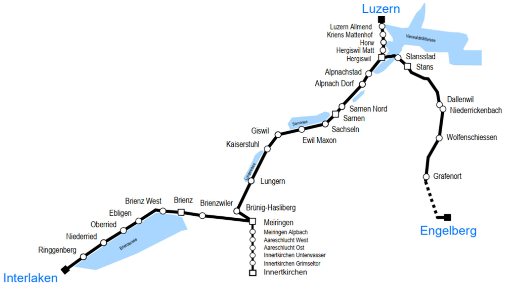

```{r setup, include=FALSE}
knitr::opts_chunk$set(echo = TRUE)
```

## Loading the Packages

For this example we use the `nnet` package (and `gamlss.add` to plot these networks) and `ggplot2` to create some plots.

```{r}
library(nnet)
library(gamlss.add)
library(dplyr)
library(ggplot2)
theme_set(theme_bw())
```

And we also need the `caret` package for some helper functions

```{r}
library(caret)
```

## Loading the Data

```{r}
d.zentralbahn <- read.csv("zentrahlbahn_nov_dataset_delay.csv", sep =",", head=TRUE )
```

## A first look at the Data "Ausfälle"

[]

Looks like i the beginning and end of november there are a bit less "Ausfälle".
Also what we can see is that there is a periodic behaviour ( Saturdays and Sundays). Because at weekends there are less traings

```{r}
d.zentralbahn %>%
  ggplot(aes(x = BETRIEBSTAG, fill = FAELLT_AUS_TF)) +
  geom_histogram(stat = "count",position = "dodge")
```

 In this plot we can clearly see that R70 and R71 "Fallen aus" more than they arriv on time. Is probably related to unglück in brienz
```{r}
d.zentralbahn %>%
  ggplot(aes(x = LINIEN_TEXT, fill = FAELLT_AUS_TF)) +
  geom_histogram(stat = "count",position = "dodge")
```





# Prepare the Data

Split the data into 80% to train and 20% to test.

```{r}
d.zentralbahn.dt <- d.zentralbahn %>%
  mutate(
    BETRIEBSTAG= as.Date(BETRIEBSTAG, format = "%d.%m.%Y"),
    FAHRT_BEZEICHNER = FAHRT_BEZEICHNER, # ???
    BETREIBER_ID = BETREIBER_ID, # ???
    BETREIBER_ABK = as.factor(BETREIBER_ABK), 
    BETREIBER_NAME = as.factor(BETREIBER_NAME), # ZVV, ZVA, etc
    PRODUKT_ID = as.factor(PRODUKT_ID),  # Zug , Bus etc
    LINIEN_ID = LINIEN_ID, # ???
    LINIEN_TEXT = as.factor(LINIEN_TEXT), # S26, IR16 etc
    UMLAUF_ID = UMLAUF_ID, # ???
    VERKEHRSMITTEL_TEXT = as.factor(VERKEHRSMITTEL_TEXT),
    ZUSATZFAHRT_TF = as.logical(ZUSATZFAHRT_TF), 
    FAELLT_AUS_TF = as.logical(FAELLT_AUS_TF),
    BPUIC = BPUIC, # ???
    HALTESTELLEN_NAME = as.factor(HALTESTELLEN_NAME),
    ANKUNFTSZEIT = as.POSIXct(ANKUNFTSZEIT, format = "%d.%m.%Y %H:%M" ),
    AN_PROGNOSE = as.POSIXct(AN_PROGNOSE, format = "%d.%m.%Y %H:%M:%S"),
    AN_PROGNOSE_STATUS = as.factor(AN_PROGNOSE_STATUS),
    ABFAHRTSZEIT = as.POSIXct(ABFAHRTSZEIT, format = "%d.%m.%Y %H:%M" ),
    AB_PROGNOSE = as.POSIXct(AN_PROGNOSE,  format = "%d.%m.%Y %H:%M:%S"),
    AB_PROGNOSE_STATUS = as.factor(AB_PROGNOSE_STATUS), 
    DURCHFAHRT_TF = as.logical(DURCHFAHRT_TF)
    
  )
```


# Remove columns with factors having only one level
```{r}

factor_levels <- sapply(d.zentralbahn.dt, function(x) if(is.factor(x)) levels(x) else NULL)
# Print the factor levels
factor_levels

#Remove Factors with only one level --> "ZB, "ZENTRAHLBAHN" , "ZUG"
d.zentralbahn <- d.zentralbahn[, sapply(d.zentralbahn, function(x) !(is.factor(x) && length(levels(x)) == 1))]
```


```{r}
set.seed(123)
is_train <- runif(nrow(d.zentralbahn)) < 0.8
mean(is_train)
```
```{r}
train <- d.zentralbahn[is_train, ]
test <- d.zentralbahn[!is_train, ]
```


## Build the network

```{r}
set.seed(412)
credit_net <- nnet(FAELLT_AUS_TF ~ . , data = train, size=16, maxit=10000, range=0.1, decay=5e-4, MaxNWts = 2000)
```

```{r}
plot(credit_net)
```
```{r}
credit_net
```