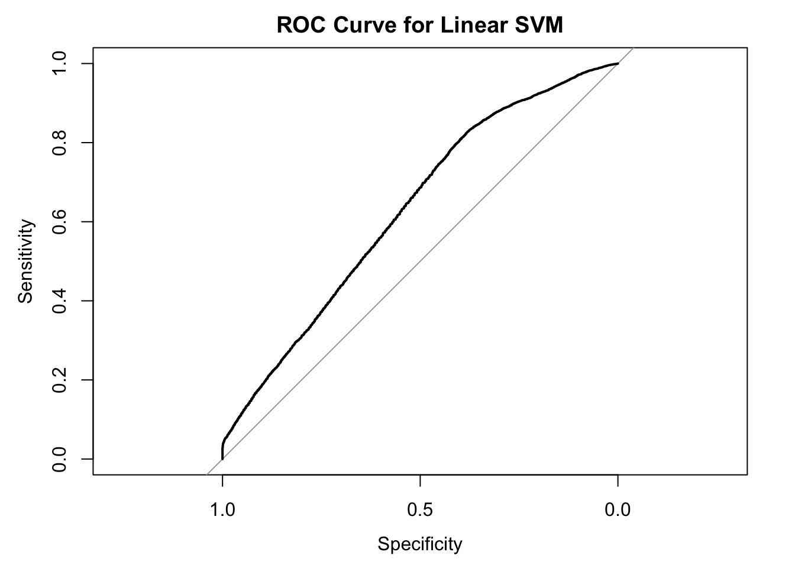
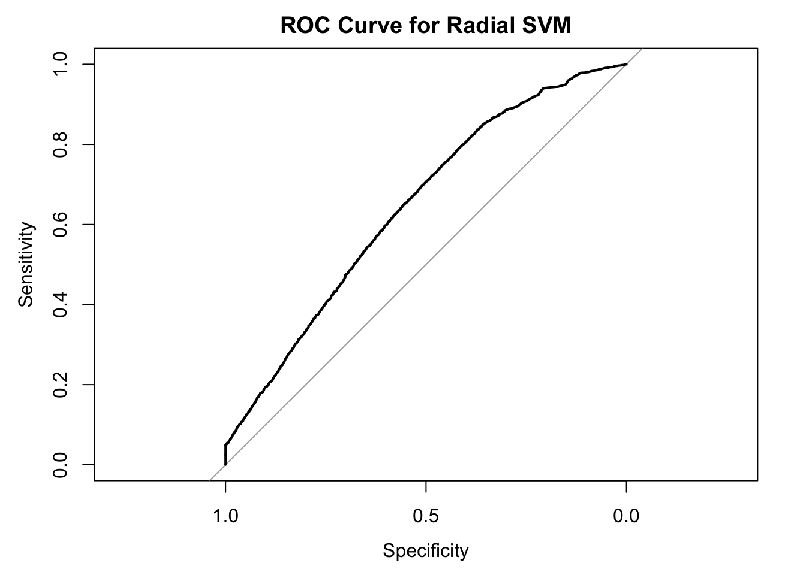
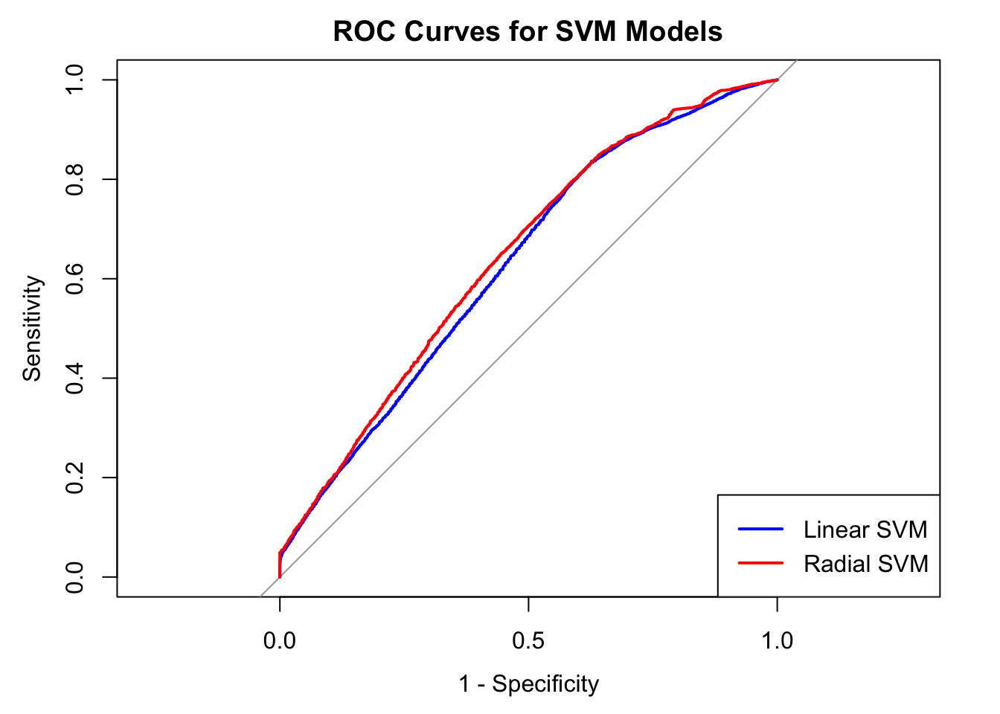

```{r, echo=FALSE , include=FALSE}
## Document related Settings and Libs
require(knitr) 
require(details)    # allows collapsible code blocks
require(gt)         # formats tables nicely

## general language settings
Sys.setenv(LANG = "en")

## Default Settings for R-Chunks
opts_chunk$set(echo = FALSE ,
               include = FALSE,
               comment = NA,
               eval = TRUE,
               message = FALSE,
               warning = FALSE)
```

# Introduction

Zentralbahn, a regional railway company, identified a pressing need to improve the overall performance of its train operations.
In response, the company initiated a comprehensive, data-driven investigation aimed at uncovering operational inefficiencies and ensuring long-term service reliability.

As part of this initiative, Zentralbahn engaged an external data science consultant to analyze publicly available OpenTransportData.
The consultant’s initial findings revealed a noticeable performance bottleneck in November 2024, likely linked to seasonal, winter-related disruptions.

Although Zentralbahn already had an internal hypothesis regarding the cause, the company is committed to an open, evidence-based approach and is seeking independent confirmation and fresh insights.
To broaden the analytical perspective, Zentralbahn partnered with the Hochschule Luzern (HSLU) to carry out a dedicated project using operational data from November 2024.

# Project Goals

<u>**1. Identifying Root Causes of Performance Bottlenecks** </u>

The primary objective is to analyze train operations during **November 2024** to:

-   Validate Zentralbahn’s internal assumptions about winter-related disruptions,
-   Identify underlying patterns or unexpected factors contributing to performance bottlenecks,
-   Provide data-driven recommendations for improving punctuality and operational efficiency on affected lines.

<u>**2. Improving Data Quality Through Predictive Modeling** </u>

A secondary goal is to address known data quality issues in Zentralbahn’s internal datasets.
Specifically, several records contain **missing or incorrect train station entries**.
HSLU is tasked with:

-   Investigating the **November 2024 dataset**, which is considered consistent and reliable,
-   Exploring the potential to **predict or classify missing train station values** using available variables such as timestamps, route IDs, or event sequences,
-   Developing a methodology that could later be applied to **recover and correct corrupted historical datasets**.

# Report Structure

To ensure a thorough and methodical exploration of different modeling approaches, responsibilities for leading the development of individual models were distributed among the team members.
The allocation of model leadership was as follows:

Leonard Dost: Linear Model, Support Vector Machine

Pascal Ackermann: Generalised Linear Model (Poisson family), Neural Network

Stefan Dreyfus: Generalised Additive Model, Generalised Linear Model (Binomial family)

While each team member took the lead on specific models, the entire team contributed actively to all stages of the project.
From data preprocessing to model evaluation and interpretation, the collaborative approach ensured consistency, knowledge sharing, and a stronger overall outcome.

The data set has 91'271 entries which fulfills the requirement of the assessment.
On the one hand, data set contained already a wide range of data types.
On the other hand, we had to add further columns in order to fullfil the requirement.
The data set has the following data types:

| **Column**            | **Data Type** |
|-----------------------|---------------|
| `BETRIEBSTAG`         | Categorical   |
| `LINIEN_TEXT`         | Categorical   |
| `HALTESTELLEN_NAME`   | Categorical   |
| `ANKUNFTSZEIT`        | Datetime      |
| `AN_PROGNOSSE`        | Datetime      |
| `ANKUNFTDELAY_sec`    | Continuous    |
| `ABFAHRTZEIT`         | Datetime      |
| `AB_PROGNOSSE`        | Datetime      |
| `ABFAHRTDELAY_sec`    | Continuous    |
| `START`               | Categorical   |
| `ZIEL`                | Categorical   |
| `DELAY_Category`      | Categorical   |
| `TAGESZEIT`           | Categorical   |
| `RUSH_HOUR`           | Categorical   |
| `w_precip_mm_Luzern`  | Continuous    |
| `w_temp_min_c_Luzern` | Continuous    |
| `w_temp_avg_c_Luzern` | Continuous    |
| `FAELLT_AUS_TF`       | Binary        |

While the table summarizes the original data types, some variables are adapted for specific models.
`ANKUNFTDELAY_sec` and `ABFAHRTDELAY_sec`, though continuous, are treated as count data in the corresponding chapter where the model requires it.
These variables are easily convertible by focusing solely on positive delay values and ignoring early arrivals or departures.

Similarly, `DELAY_Category` is transformed into a binomial variable for binary classification tasks.

All public transport data used in this project was obtained from [OpenTransportData](https://archive.opentransportdata.swiss/actual_data_archive.htm), which provides official, high-resolution datasets on public transportation in Switzerland.
Weather-related data was sourced from [Swiss Federal Geoportal](https://data.geo.admin.ch), offering location-specific historical weather records relevant to the operational context.

The following chapters present different approaches to modeling.
The analysis begins with a general approach, using an initial artificial neural network (ANN) without extensive knowledge of the data.
It then progresses toward more granular and detailed models.
In the final chapter, the insights gained throughout the analysis are consolidated and integrated into a comprehensive model.

```{r Imports}

library(dplyr)
library(scales)
library(nnet)
library(gamlss.add)
library(dplyr)
library(mgcv)
library(tidyr)
library(ggplot2)
library(caret)
library(doParallel)
library(pROC)
library(MLmetrics)
theme_set(theme_bw())

```

# A First Look: Artificial Neural Network

This chapter investigates the predictability of train cancellations without performing prior exploratory data analysis (EDA).
It serves as an initial attempt to understand the underlying data.
More detailed analyses using simpler and more interpretable models will follow in subsequent chapters.

An artificial neural network (ANN) enables the construction of a predictive model without requiring extensive knowledge of the data structure.
It can provide early indications of whether the data contains a meaningful signal.

Therefore, the approach directly attempts to predict whether a train is cancelled, using all available variables, except those that explicitly reveal cancellation status.
These are:

-   `AN_PROGNOSE` and `AB_PROGNOSE`: Always `NA` when a train is cancelled
-   All derived columns such as:
    -   `ABFAHRTDELAY_sec`,
    -   `ANKUNFTDELAY_sec`,
    -   `RUSH_HOUR`, `TAGESZEIT`, `DELAY_CATEGORY`
    -   `ZIEL`, `START`

These variables are excluded to avoid data leakage.

```{r Read Data}
#### Read in Data ####----------------------------------------------------------
v.to.drop <- c("AN_PROGNOSE", "AB_PROGNOSE",
               "ABFAHRTDELAY_sec",
               "ANKUNFTDELAY_sec", "TAGESZEIT", 
               "RUSH_HOUR", "Delay_Category", "ZIEL", "START"
)

d.ann<- read.csv("data/zentrahlbahn_final.csv") %>% 
  select(-all_of(v.to.drop), -starts_with("w_")) # Also drop all weather data


```

```{r Ratio Cancelled}
d.ann.cancelled <- d.ann %>% 
  filter(FAELLT_AUS_TF == TRUE)
cancelled <- nrow(d.ann.cancelled)
tot <- nrow(d.ann)
r.cancelled <- cancelled/tot
rm(d.ann.cancelled)
```

## Data Preparation

As a first step, the distribution of the response variable is examined.
An initial analysis indicates that `r percent(r.cancelled)` of the trains in the dataset are cancelled.
This was taken into account during data preparation.
For the ANN to work, the following steps were performed:

1.  Convert character and logical variables to factors\
2.  Remove factors with fewer than two levels (contain no information)\
3.  Use only factor variables to keep the ANN simple\
4.  Drop time columns because they include a large number of levels\
5.  Perform one-hot encoding\
6.  Stratify train and test data\
7.  Downsample train data to ensure an equal number of cancelled and uncancelled trains

```{r Perpare Data}
convert_all_possible_to_factor <- function(df) {
  df[] <- lapply(df, function(col) {
    if (is.character(col) || is.logical(col)) {
      as.factor(col)
    } else {
      col
    }
  })
  return(df)
}
drop_factors_with_less_than_two_levels <- function(df) {
  # Identify factors with fewer than two levels (0 or 1)
  small_level <- sapply(df, function(x) is.factor(x) && length(levels(x)) < 2)
  
  # Remove those columns
  df_clean <- df[, !small_level, drop = FALSE]
  
  return(df_clean)
}
drop_non_factors <- function(df) {
  df[, sapply(df, is.factor), drop = FALSE]
}

d.ann <- convert_all_possible_to_factor(d.ann)
d.ann <- drop_factors_with_less_than_two_levels(d.ann)
d.ann <- drop_non_factors(d.ann) 
d.ann <- d.ann %>% select(!ANKUNFTSZEIT) #Remove Time 
d.ann <- d.ann %>% select(!ABFAHRTSZEIT) #Remove Time 

d.ann.rv <-  d.ann %>% select(FAELLT_AUS_TF) # Response Variable
d.ann.pred <-  d.ann %>% select(BETRIEBSTAG, LINIEN_TEXT,HALTESTELLEN_NAME) 
# BEtriebstag, LinienText and Haltestellenname are the predictors for the model


#Create Dummy Variables 
dummies <- dummyVars(~ ., data = d.ann.pred)
data_dummies <- predict(dummies, newdata = d.ann.pred)

# Add one hot encoded predictors to RV
d.ann.rdy <- bind_cols(d.ann.rv, data_dummies)

```

```{r Test and Train Data 2, echo =TRUE, cached=TRUE}
set.seed(123)
train_index <- createDataPartition(d.ann.rdy$FAELLT_AUS_TF, p = 0.8, list = FALSE)

train <- d.ann.rdy[train_index, ]
test <- d.ann.rdy[-train_index, ]

# Make sure there are as much Cancelled as Non Cancelled observations in Train Data
majority_class <- train[train$FAELLT_AUS_TF == FALSE, ]
minority_class <- train[train$FAELLT_AUS_TF == TRUE, ]

# Sample from majority class to match minority class size
set.seed(123)
majority_downsampled <- majority_class[sample(nrow(majority_class), nrow(minority_class)), ]

# Combine minority class with downsampled majority class
train_downsampled <- rbind(minority_class, majority_downsampled)

# Shuffle rows 
train_downsampled <- train_downsampled[sample(nrow(train_downsampled)), ]


```

## Building the Network

Building the Network included a lot of trial and error.
Because for many configurations the model did not converge.
In the end 3 predictors could be found which lead to quite good prediction:

-   BETRIEBSTAG
-   LINIEN_TEXT
-   HALTESTELLEN_NAME

```{r Build the network, echo=TRUE, cache =TRUE, eval=TRUE}


set.seed(412)
fealltaus_net <- nnet(FAELLT_AUS_TF ~  ., data = train_downsampled, size=15, maxit=500, range=0.1, decay=1e-4, MaxNWts = 10000)
```

```{r Plot NET, include =TRUE}
plot(fealltaus_net)
```

## Results

The model successfully predicts train cancellations using only three categorical predictors: **BETRIEBSTAG**, **LINIEN_TEXT**, and **HALTESTELLEN_NAME**.
Despite the test data containing 80% uncancelled and 20% cancelled trains, the model performs well thanks to stratification and downsampling during training.

Given this class imbalance, accuracy alone is not the most informative metric.
Instead, specificity provides a more meaningful evaluation of the model’s ability to correctly identify cancelled trains.
Encouragingly, the model attains a specificity of 95.43%, indicating reliable detection of cancellations within the cancelled train instances.

These findings highlight that these predictors are valuable features and warrant further exploration through more detailed modeling and analysis.

```{r Test the Network, include=TRUE}
test.n.result <- test %>% select(-FAELLT_AUS_TF)
pred <- predict(fealltaus_net, test.n.result, type="class")
cm_nn <- table(pred=pred, true=test$FAELLT_AUS_TF)

confusionMatrix(as.factor(pred), as.factor(test$FAELLT_AUS_TF))

```

# Linear Model

```{r import data}
d.trains <- read.csv("data/zentrahlbahn_final.csv",
                     header = TRUE,
                     stringsAsFactors = TRUE)
##
#str(d.trains)
```

```{r preprocessing}
library(dplyr)

## Reducing data
d.trains <- d.trains %>%
  select(ANKUNFTDELAY_sec, ABFAHRTDELAY_sec, START, ZIEL, w_precip_mm_Luzern, w_temp_avg_c_Luzern, RUSH_HOUR) %>%
  mutate(
    ANKUNFTDELAY_sec = as.integer(as.character(ANKUNFTDELAY_sec)),
    ABFAHRTDELAY_sec = as.integer(as.character(ABFAHRTDELAY_sec))
  ) %>%
  filter(!is.na(ANKUNFTDELAY_sec) & !is.na(ABFAHRTDELAY_sec)) %>%
  mutate(start_in_Luzern = factor(
    case_when(
      START == "Luzern" ~ "Luzern",
      TRUE ~ "Other"
    ),
    levels = c("Other", "Luzern")
  )) %>% 
  mutate(ziel_in_Luzern = factor(
    case_when(
      ZIEL == "Luzern" ~ "Luzern",
      TRUE ~ "Other"
    ),
    levels = c("Other", "Luzern")
  )) %>%
  rename(delay_arrival = ANKUNFTDELAY_sec, delay_departure = ABFAHRTDELAY_sec)

## debugging
str(d.trains)
summary(d.trains)
```

```{r check distribution}
par(mfrow = c(1, 2))  # Two plots side by side

hist(d.trains$delay_arrival, breaks = 100, col = "lightblue",
     main = "Arrival Delay Distribution",
     xlab = "Arrival Delay (seconds)")

hist(d.trains$delay_departure, breaks = 100, col = "lightgreen",
     main = "Departure Delay Distribution",
     xlab = "Departure Delay (seconds)")

par(mfrow = c(1, 1))  # Reset to one plot

```

To explore whether the Swiss Zentralbahn railway system incorporates buffer times into its scheduling, we examine the relationship between **arrival delays** and subsequent **departure delays**.
The core question: *If a train arrives late, does it depart late as well* –*or does the schedule absorb the delay?* A slope of 1 in a delay-to-delay model would indicate full propagation, while a slope below 1 would suggest some level of built-in buffer or recovery.

Understanding this relationship is key to improving operational robustness.
Our modeling strategy starts with a simple baseline and evolves to include external (e.g. weather) and operational (e.g. rush hour, hub status) factors.
We also apply log-transformations to normalize the right-skewed distribution of delay times, improving interpretability and model fit.

## Data Preparation

We begin by filtering the data to focus only on meaningful delay values, excluding negative delays which represent early arrivals or departures.
These are operationally different phenomena and can distort the regression analysis.

We then transform the delay variables using a log transformation to account for the right-skewed distribution.
Rainfall is also log-transformed due to its zero-inflated and skewed nature.

```{r}
# Filter: Remove negative delays (early trains)
d.trains_filtered <- d.trains %>%
  filter(delay_arrival >= 0, delay_departure >= 0)

# Transform delay variables to log scale (add 1 to avoid log(0))
d.trains_filtered <- d.trains_filtered %>%
  mutate(
    log_arrival = log(delay_arrival + 1),
    log_departure = log(delay_departure + 1),
    log_rain = log(w_precip_mm_Luzern + 0.1)
  )

# Relevel categorical variables

d.trains_filtered$RUSH_HOUR <- relevel(d.trains_filtered$RUSH_HOUR, ref = "rush_hour_none")
d.trains_filtered$start_in_Luzern <- relevel(d.trains_filtered$start_in_Luzern, ref = "Other")
d.trains_filtered$ziel_in_Luzern  <- relevel(d.trains_filtered$ziel_in_Luzern,  ref = "Other")
```

## Step 1: Baseline Log-Log Model

We first fit a simple model with only the arrival delay as a predictor.
The goal is to assess the pure propagation effect, without confounding from other variables.

```{r LM Baseline Model, include=TRUE}
model_loglog <- lm(log_departure ~ log_arrival, data = d.trains_filtered)
summary(model_loglog)
```

### Interpretation

Although delays are recorded in whole seconds, they reflect an underlying continuous process.
Applying a log transformation improves model fit and interpretability by addressing skewness, even if it visually compresses or bands some of the data.

From the `summary()` output of our baseline model:

-   **Slope (`log_arrival` ≈ 0.936)**: Indicates that a 1% increase in arrival delay corresponds to a 0.94% increase in departure delay – evidence of near-complete delay propagation.

-   **Intercept (\~0.105)**: Suggests a small expected delay even when arrival delay is minimal.

-   **R-squared (≈ 0.834)**: Implies that over 83% of the variation in log departure delay is explained by log arrival delay alone.

-   **Statistical significance**: Very low p-values and a small residual standard error (\~0.479) confirm a strong model fit.

The following plot visually confirms the strength of the relationship:

::: {style="text-align: center;"}
```{r Plot Baseline Model, include=TRUE, fig.width=5, fig.height=3}
# Visualize the log-log relationship
plot(
  d.trains_filtered$log_arrival, d.trains_filtered$log_departure,
  pch = 16, col = rgb(0, 0, 1, 0.1),
  main = "Log(Departure Delay) vs Log(Arrival Delay)",
  xlab = "Log(Arrival Delay + 1)",
  ylab = "Log(Departure Delay + 1)"
)
abline(model_loglog, col = "red", lwd = 2)
```
:::

Most observations cluster tightly around the fitted line, reinforcing that **arrival delay is a highly predictive factor** for departure delay, with minimal evidence of buffering in the current system.

## Step 2: Including Environmental and Temporal Context

Next, we add external predictors – **log-transformed rainfall**, **temperature**, and **rush hour categories** – to see if delay propagation is influenced by weather or time of day.

```{r LM Extended Model, include=TRUE}
model_extended <- lm(
  log_departure ~ log_arrival + log_rain + w_temp_avg_c_Luzern + RUSH_HOUR,
  data = d.trains_filtered
)
summary(model_extended)
```

### Interpretation

-   `log_arrival` remains the dominant predictor.

-   Neither **rainfall** nor **temperature** has a significant effect.

-   A small but statistically significant decrease in delay propagation is observed during the **evening rush hour**, but not during the morning peak.

This suggests that delays are consistent across weather conditions and most times of day, but may be **slightly better absorbed in the evening**.

The following plot illustrates the residuals of the extended model:

::: {style="text-align: center;"}
```{r Plot Extended Model, include=TRUE, fig.width=5, fig.height=3}
plot(
  fitted(model_extended), residuals(model_extended),
  pch = 16, col = rgb(1, 0, 0, 0.2),
  main = "Residuals vs Fitted: Extended Model",
  xlab = "Fitted Values",
  ylab = "Residuals"
)
abline(h = 0, col = "blue", lwd = 2)
```
:::

While the residuals vs. fitted plot shows some banding and slight curvature – particularly for higher fitted values – this is expected due to the log transformation of discrete delay values.
The absence of a clear funnel or strong pattern suggests that the model is reasonably well-specified, though minor heteroscedasticity may still be present.
This observation could motivate future exploration of **non-linear models** or those that account for **changing variance**, such as generalized additive models (GAMs) or quantile regression.

## Step 3: Analyzing Luzern as a Major Hub

Finally, we test whether Luzern's role as a major start or end station affects the delay propagation dynamics.
We include binary indicators for whether a train **starts** or **ends** in Luzern.

```{r LM Luzern Model, include=TRUE}
model_luzern <- lm(
  log_departure ~ log_arrival + log_rain + w_temp_avg_c_Luzern + start_in_Luzern + ziel_in_Luzern,
  data = d.trains_filtered
)
summary(model_luzern)
```

### Interpretation

-   Trains that **start in Luzern** have, on average, **11.2% lower departure delay**, controlling for other factors.

-   Trains that **end in Luzern** show **12.5% lower delay propagation**, possibly due to better infrastructure or end-of-line recovery buffers.

-   Again, **rain and temperature remain non-significant**, reinforcing that **operational station context matters more than weather**.

The residual plot below shows the model’s prediction consistency:

::: {style="text-align: center;"}
```{r Plot Luzern Model, include=TRUE, fig.width=5, fig.height=3}
plot(
  fitted(model_luzern), residuals(model_luzern),
  pch = 16, col = rgb(0, 0.5, 0, 0.2),
  main = "Residuals vs Fitted: Luzern Model",
  xlab = "Fitted Values",
  ylab = "Residuals"
)
abline(h = 0, col = "blue", lwd = 2)
```
:::

This plot again shows the expected banding and slight downward curvature due to the log transformation of discrete delay values.
Similar to the extended model, there is no clear funnel or heteroscedastic pattern.
The residuals are broadly symmetric and centered around zero, indicating that the Luzern model is well specified and produces consistent predictions across the range of fitted values.

## Conclusion

A limitation of this analysis lies in the **mismatch between data resolutions**: train delays are recorded at the stop level, while weather data is only available as **daily averages**.
As a result, short-term or location-specific weather effects may be underestimated.

Nonetheless, our models show that **arrival delays are the main driver** of departure delays, with nearly full propagation (1% increase in arrival delay → \~0.94% increase in departure delay).
**Rainfall and temperature** have no significant effect, whereas **starting or ending in Luzern** significantly reduces delay propagation – highlighting Luzern's role as a stabilizing hub.

These insights suggest that operational improvements should focus on **non-hub stations**, where delays are more likely to propagate.
Enhancing recovery capacity or increasing buffer time in these areas may offer the best return in reducing system-wide disruptions.

# Generalised Additive Model

In this project, we apply Generalized Additive Models (GAMs) to analyze the effects of various predictors on train delays, specifically focusing on the response variables ANKUNFTDELAY_min (arrival delay in minutes) and ABFAHRTDELAY_min (departure delay in minutes).
Due to the limited availability of continuous variables in our dataset these two delay metrics will be the response variables we will focus on.
A key subset of our predictors is related to weather conditions.
However, because the Zentralbahn railway line spans multiple climatic regions, comparing weather-related predictors across all stations introduces variability that may obscure meaningful patterns.
To address this, we restrict our analysis to a subset of stations located within the Lucerne region, where the climate is more uniform.

```{r gam-general-codes-subset, include=FALSE, echo=FALSE}

#Creating subset

zb_final <- read.csv("data/zentrahlbahn_final.csv", header = TRUE, stringsAsFactors = TRUE)

# Define the specific Haltestellen in the region of Lucerne
haltestellen_to_keep <- c("Luzern", "Luzern Allmend/Messe", "Kriens Mattenhof", "Horw", 
                          "Hergiswil Matt", "Hergiswil NW", "Stansstad", "Stans")

zb_final_subset <- zb_final %>%
  filter(HALTESTELLEN_NAME %in% haltestellen_to_keep)

# Create new columns with delay in minutes
zb_final_subset <- zb_final_subset %>%
  mutate(
    ABFAHRTDELAY_min = ABFAHRTDELAY_sec / 60,
    ANKUNFTDELAY_min = ANKUNFTDELAY_sec / 60
  )


#Removing rows NA in ANKUNFTDELAY_min and ABFAHRTDELAY_min

zb_final_subset <- zb_final_subset %>%
  filter(!is.na(ANKUNFTDELAY_min))

sum(is.na(zb_final_subset$ANKUNFTDELAY_min)) #Checking if ANKUNFTDELAY_min NA is 0

zb_final_subset <- zb_final_subset %>%
  filter(!is.na(ABFAHRTDELAY_min))

sum(is.na(zb_final_subset$ABFAHRTDELAY_min)) #Checking if ABFAHRTDELAY_min NA is 0

```

R assumes for GAM models the Gaussian family for the response variables.
Therefore, let's have a look if the response variables ANKUNFTDELAY_min and ABFAHRTDELAY_min are Gaussian distributed.

```{r first-histogram, include=TRUE, echo=FALSE}

par(mfrow = c(1, 2))


hist(zb_final_subset$ANKUNFTDELAY_min, main = "Histogram of ANKUNFTDELAY_min", xlab = "ANKUNFTDELAY_min", col = "lightblue", breaks = 100, xlim = c(-2,8))


hist(zb_final_subset$ABFAHRTDELAY_min, main = "Histogram of ABFAHRTDELAY_min", xlab = "ABFAHRTDELAY_min", col = "lightblue", breaks = 100, xlim = c(-2,8))


```

We see that both response variables are not normally distributed.
In real-world train operations, early arrivals or departures are relatively uncommon compared to delays.
Moreover, the distribution indicates that longer delays occur less frequently than shorter ones, reflecting typical delay patterns observed in Swiss public transportation.
For this reason, we restrict our dataset for the GAM analysis to observations with delays between -2 and +4 minutes, aiming to ensure a distribution that more closely approximates the Gaussian assumption required by the model.

```{r second-histogram, include=TRUE, echo=FALSE}

par(mfrow = c(1, 2))

zb_final_subset <- zb_final_subset %>%
  filter(ABFAHRTDELAY_min >= -2 & ABFAHRTDELAY_min <= 4,
         ANKUNFTDELAY_min >= -2 & ANKUNFTDELAY_min <= 4)


hist(zb_final_subset$ANKUNFTDELAY_min, main = "Histogram of ANKUNFTDELAY_min", xlab = "ANKUNFTDELAY_min", col = "lightgreen", breaks = 50, xlim = c(-2,4))


hist(zb_final_subset$ABFAHRTDELAY_min, main = "Histogram of ABFAHRTDELAY_min", xlab = "ABFAHRTDELAY_min", col = "lightgreen", breaks = 50, xlim = c(-2,4))


```

The histogram indicates an approximately normal distribution.
Therefore, the dataset is now suitable for fitting with GAMs.

As a first step, we will explore how the average temperature in Lucerne affects arrival delays of trains.

```{r gam-Ankunft-temp, include=TRUE, echo=FALSE}

gam_Ankunft_temp <- gam(ANKUNFTDELAY_min ~ s(w_temp_avg_c_Luzern), data = zb_final_subset) 

summary (gam_Ankunft_temp)

```

The p-value associated with the smooth term is close to zero, providing strong evidence that the average temperature in Lucerne has a statistically significant effect on arrival delays.
The estimated effective degrees of freedom (edf ≈ 9) suggest a moderately complex, non-linear relationship.
However, the adjusted R-squared value of 0.036 and the explained deviance of only 3.67% indicate that the model captures only a small portion of the variation in arrival delays.
Thus, while the effect is significant, temperature alone does not explain much of the delay variability.

This is why will proceed with a more detailed analysis and explore how time of day, train lines, average temperature and precipitation affect departure delays of trains.

Interpretation of Parametric Coefficients:

```{r gam-temp-precip-tageszeit-linien_text, include=TRUE, echo=FALSE}

gam_temp_precip_tageszeit_linien_text <- gam(ABFAHRTDELAY_min ~ TAGESZEIT + LINIEN_TEXT + s(w_temp_avg_c_Luzern) + s(w_precip_mm_Luzern), data = zb_final_subset) 

summary(gam_temp_precip_tageszeit_linien_text)

```

The reference levels for the categorical predictors are evening for TAGESZEIT and EXT for LINIEN_TEXT.
Under these baseline conditions (evening, 0°C, and 0 mm precipitation), the EXT line of Zentralbahn in the Lucerne region has an average departure delay of approximately 1.25 minutes.

The time of day has a statistically significant effect on departure delays.
Compared to the evening (the reference category), trains departing at other times of day experience between 0.12 and 0.30 minutes less delay on average.
These differences are highly significant, as indicated by the very small p-values (all p \< 0.0001), suggesting strong evidence that delays vary by time of day.

Regarding train lines, the IR line shows a reduction of 0.22 minutes compared to EXT, although this difference is not statistically significant (p = 0.5).
In contrast, the PE line exhibits the largest reduction, with trains experiencing on average 2.32 minutes less delay than EXT, a difference that is statistically significant.
Likewise, the S4, S41, S44, and S55 lines show significantly reduced delays compared to EXT, with reductions of 0.84, 1.35, 1.04, and 1.96 minutes, respectively.
The S5 line’s difference (0.51 minutes less) is not statistically significant.

Interpretation of the Smooth Terms:

```{r effect_temperature_depature_delay, include=TRUE, echo=FALSE}
plot(gam_temp_precip_tageszeit_linien_text, residuals = TRUE, select = 1,main = "Effect of Temperature on Departure Delay")

```

The smooth term for average temperature has an estimated effective degrees of freedom (edf) of approximately 9, indicating a moderately complex non-linear relationship with departure delay.
We have strong evidence that it is not 0 with a p-value \< 0.05.
The corresponding plot reveals that temperatures between 0 and 6°C have a stronger effect on departure delay, whereas between roughly 6–7°C and 8–10°C the effect is minimal.

```{r effect_percipitation_depature_delay, include=TRUE, echo=FALSE}
plot(gam_temp_precip_tageszeit_linien_text, residuals = TRUE, select = 2, main = "Effect of Precipitation on Departure Delay")
```

Similarly, the smooth term for average precipitation (w_precip_mm_Luzern) has an edf of about 8.32, suggesting a moderately complex non-linear relationship.
We have strong evidence that it is not 0 with a p-value \< 0.05.

The precipitation plot shows a clear non-linear relationship between precipitation and departure delays.
There is a strong effect at lower precipitation levels (up to approximately 20 mm), after which the curve flattens between around 22 mm and 50 mm, indicating a reduced impact on delays.
One possible explanation for this flattening is that higher precipitation levels may coincide with times of reduced train activity—such as during the night—when fewer departures occur, thereby minimizing the observed effect on overall delays.
Additionally, since the dataset only covers November 2024, it is possible that there were relatively few instances of heavy precipitation during this period in the Lucerne region, which may limit the model's ability to capture stronger effects at higher precipitation levels.

Overall model performance:

The adjusted R² value of 0.119 means that the model explains around 11.9% of the variation in departure delays.
This suggests that the predictors included in the model have a measurable effect on delays, but a large part of the variation (around 88%) is still not accounted for.
This can be considered as not unusual in real-world transportation data, where many factors that influence delays—such as technical problems, temporary disruptions, staffing issues or operational decisions—are not included in the dataset.
While the model successfully identifies several statistically significant predictors, it also shows that more variables or more complex modeling approaches might be needed to better capture all the factors that contribute to departure delays.

Conclusion:

GAM analysis revealed that weather factors significantly impact train delays in the Lucerne region, aligning with the project’s goal to understand winter-related disruptions in November.
However, the models capture only a small portion of the variability, suggesting further investigation is needed to fully explain performance bottlenecks.

# Generalised Linear Model with family set to Binomial

To further investigate the factors influencing train delays on the Zentralbahn network, a Generalized Linear Model (GLM) with a binomial family is applied.
This model aims to predict the likelihood of a train being delayed based on key operational variables, including train line and rush hour status.
By classifying delays as a binary outcome, the analysis provides deeper insights into line-specific vulnerabilities and the broader operational challenges faced during peak travel times.
This contributes to the project’s overarching goal of identifying root causes of performance bottlenecks and improving punctuality through data-driven strategies.

```{r binary-codes-subset, include=FALSE, echo=FALSE}

zb_final <- read.csv("data/zentrahlbahn_final.csv", header = TRUE, stringsAsFactors = TRUE)

#Subset
zb_final_binominal <- zb_final %>%
  mutate(
    Train_Delayed = case_when(
      Delay_Category == "On Time" ~ FALSE,    
      Delay_Category == "Unknown" ~ NA,
      Delay_Category %in% c("Minor Delay", "Moderate Delay", "Significant Delay") ~ TRUE,  
      TRUE ~ NA  # Handle any other unrecognized categories as NA
    ),
    
   
    Train_RUSH_HOUR = case_when(
      RUSH_HOUR == "rush_hour_none" ~ FALSE,
      RUSH_HOUR %in% c("rush_hour_vormittag", "rush_hour_abend") ~ TRUE,
      is.na(RUSH_HOUR) ~ NA,  # Handle NA values properly
      TRUE ~ NA  # Any other unrecognized or unexpected RUSH_HOUR values are NA
    )
  ) %>%
  select(
    1:(match("Delay_Category", names(.))),  # Columns up to Delay_Category
    Train_Delayed,  # Add Train_Delayed after Delay_Category
    (match("Delay_Category", names(.)) + 1):(match("RUSH_HOUR", names(.))),  # Columns between Delay_Category and RUSH_HOUR
    Train_RUSH_HOUR,  # Add Train_RUSH_HOUR after RUSH_HOUR
    (match("RUSH_HOUR", names(.)) + 1):ncol(.)  # Columns after RUSH_HOUR
  )

# Create new columns with delay in minutes
zb_final_binominal <- zb_final_binominal %>%
  mutate(
    ABFAHRTDELAY_min = ABFAHRTDELAY_sec / 60,
    ANKUNFTDELAY_min = ANKUNFTDELAY_sec / 60
  )


#Removing rows NA in ANKUNFTDELAY_min

zb_final_binominal <- zb_final_binominal %>%
  filter(!is.na(ANKUNFTDELAY_min))

sum(is.na(zb_final_binominal$ANKUNFTDELAY_min)) #Checking if ANKUNFTDELAY_min NA is 0

zb_final_binominal <- zb_final_binominal %>%
  filter(!is.na(ABFAHRTDELAY_min))

sum(is.na(zb_final_binominal$ABFAHRTDELAY_min)) #Checking if ABFAHRTDELAY_min NA is 0

# Convert the Train_Delayed to numeric (0 = FALSE, 1 = TRUE) otherwise we can not use it with a logistic regression model
zb_final_binominal$Train_Delayed <- as.numeric(zb_final_binominal$Train_Delayed)

```

```{r first-plotting, include=TRUE, echo=FALSE}
#Plotting the data

zb_final_binominal %>%
  group_by(LINIEN_TEXT) %>%
  summarise(ProportionDelayed = mean(Train_Delayed, na.rm = TRUE)) %>%
  ggplot(aes(x = reorder(LINIEN_TEXT, ProportionDelayed), y = ProportionDelayed)) +
  geom_point(size = 3, color = "steelblue") +
  labs(x = "Train Line", y = "Proportion Delayed") +
  theme_minimal()

```

In this plot, we can see that the EXT line has the highest proportion of delayed trains, with approximately 40% of its services experiencing delays.
The line with the second highest delay rate is the R71, where around 24% of trains are delayed.
On the other end of the spectrum, the S41 line shows the lowest delay rate, with only about 1% of its trains being delayed.

To predict whether a train is delayed, we use a binomial GLM with Train_Delayed as the binary response variable and LINIEN_TEXT (train line) as the predictor.
This model estimates how the probability of delay varies across different train lines.

```{r glm-delay, include=TRUE, echo=FALSE}

glm_delay <- glm(Train_Delayed ~ LINIEN_TEXT, family = "binomial", data = zb_final_binominal)

summary(glm_delay)

```

The number of Fisher Scoring iterations is 7, which is an acceptable value.
The dispersion parameter in the model was calculated by dividing the residual deviance (21375) by the residual degrees of freedom (57209), yielding a value of 0.374.
This value, being less than 1, indicates that there is no overdispersion in the data.
Therefore, the binomial logistic regression is an appropriate fit for the dataset, and no adjustments for overdispersion are necessary.

On one hand, the p-values for almost all the train lines are very small, indicating that the train lines have a statistically significant effect on whether a train is delayed or not.
Since the coefficients for the train lines are negative, it suggests that the different train lines have a lower likeliness of being delayed compared to the baseline train line.

On the other hand, the train line R71, which operates between Meiringen and Innertkirchen, has a p-value above 0.05.
This suggests that R71 does not have a statistically significant impact on whether a train is delayed or not.
This is interesting because, when the predictors were plotted, R71 was the line with the second-highest probability of delay, with an average delay of around 24%.
The reason for this contradiction could be that while the R71 line might often experience delays, the variance of the delays might be quite narrow.
To explore this, let's take a look at the boxplot of the train delays by line.

```{r boxplot-ANKUNFTDELAY_min-LINIEN_TEXT, include=TRUE, echo=FALSE}

boxplot(ANKUNFTDELAY_min ~ LINIEN_TEXT , data = zb_final_binominal)

```

In the boxplot, we can see that the R71 has a relatively large variance between the 25th and 75th percentiles of the data.
Nevertheless, R71 has fewer outliers compared to the other lines.
The delays on R71 might be consistent but not extreme enough to be detected as a significant predictor in the GLM.

Although R71 has a relatively high average delay, this does not necessarily imply that the line itself is a major factor in predicting delays.
The GLM is trying to predict the probability of a delay (yes/no) based on various predictors.
Other variables—such as weather, time of day, or operational factors—might influence whether a delay occurs for R71 trains.

Lets have now a look at the coefficients of glm_delay

```{r exp-coef-glm-delay, include=TRUE, echo=FALSE}

exp(coef(glm_delay)) %>% round(digits=2)

```

To interpret the effect of different train lines on delay likelihood, the logistic regression coefficients were exponentiated to obtain odds ratios.
Compared to the baseline (EXT), all other lines show significantly lower odds of delay.
For example, line IR has 91% lower odds of delay, S41 has 99% lower odds, and lines PE, R70, and S5 also show substantial reductions (93%, 91%, and 95% lower odds, respectively).
This confirms that EXT is far more prone to delays than the other lines.

As a next step, we simulate predictions using the GLM to estimate the likelihood of train delays, and then compare these simulated results with the actual dataset.

```{r simulation-glm-delay, include=FALSE, echo=FALSE}

# Set seed for reproducibility
set.seed(123)

# Simulate new data based on existing data's structure (e.g., random values for LINIEN_TEXT)
simulated_data <- data.frame(
  LINIEN_TEXT = sample(levels(zb_final_binominal$LINIEN_TEXT), 10000, replace = TRUE) #increased the n of trials in order to have higher sampling and higher probability range
)

# Predict the probability of delay for these simulated data points
simulated_data$predicted_prob <- predict(glm_delay, newdata = simulated_data, type = "response")

# Plotting the simulated probabilities of train delays by train line

ggplot(simulated_data, aes(x = reorder(LINIEN_TEXT, predicted_prob), y = predicted_prob, color = LINIEN_TEXT)) +
  geom_jitter(alpha = 0.5, width = 0.2, height = 0) +
  labs(x = "Train Line", y = "Simulated Probability of Delay") +
  theme_minimal() +
  theme(
    axis.text.x = element_text(angle = 45, hjust = 1), # Rotate x-axis labels
    panel.border = element_blank(), # Remove the box around the plot
    legend.position = "none" # Remove the legend
  )
```

```{r summary-simulated-data, include=TRUE, echo=FALSE}

summary(simulated_data)

```

The mean of the simulated data is 0.105.
This is the reason why we cannot take a threshold of 0.5.
This would result in nearly all cases being classified as non-delayed, since very few predicted probabilities exceed 0.5—ultimately leading to extremely poor sensitivity and almost no true positives.

Several thresholds were tested to determine the optimal cut-off point for classifying delays based on the predicted probabilities.
Thresholds such as 0.03, 0.08, and 0.1 were evaluated, but they either led to a very low specificity or poor sensitivity.
A threshold of 0.2 appeared to offer the most reasonable trade-off between correctly identifying delayed trains (sensitivity) and avoiding false delay predictions (specificity), making it the most balanced choice for this model.

```{r confusion-matrix-simulated-data, include=TRUE, echo=FALSE}
# Discretize the simulated data
simulated_data$simulated_delay <- ifelse(simulated_data$predicted_prob > 0.2, 1, 0)

# Sample from the simulated data with replacement to match the number of rows in the real dataset
set.seed(123)
simulated_sample <- simulated_data[sample(1:nrow(simulated_data), nrow(zb_final_binominal), replace = TRUE), ]

# Create the confusion matrix
# Making sure the factor levels are the same for both the simulated data and the real data
simulated_sample$simulated_delay <- factor(simulated_sample$simulated_delay, levels = c(0, 1))
zb_final_binominal$Train_Delayed <- factor(zb_final_binominal$Train_Delayed, levels = c(0, 1))


# Comparing the real data delays with the simulated delays
conf_matrix <- confusionMatrix(as.factor(simulated_sample$simulated_delay), as.factor(zb_final_binominal$Train_Delayed))

# Printing the confusion matrix
print(conf_matrix)
```

The model's accuracy is 76.96%, which at first glance suggests decent performance, but this metric is heavily influenced by the significant imbalance between delayed and non-delayed trains in the dataset.
Due to the high punctuality of Swiss trains, the vast majority of observations are non-delays, making accuracy a somewhat misleading indicator of model effectiveness.

Sensitivity, which captures how well the model identifies actual delays, is fairly high at 79.8%, indicating that the model detects most delay cases.
However, specificity is low at 20.0%, meaning it struggles to correctly identify non-delayed trains, frequently labeling them as delayed.
The model's precision is high at 95.2%, so when it predicts a delay, it is usually right.

On the other hand, the negative predictive value is low at 4.7%, reflecting poor performance in correctly predicting trains that are on time.

Balanced accuracy, which considers both sensitivity and specificity, is 49.9% suggesting the model performs no better than random guessing when it comes to balancing delay and non-delay predictions.

The binomial GLM successfully identifies line-specific vulnerabilities and the overall likelihood of train delays on the Zentralbahn network.
Despite strong precision in predicting delays, the model struggles to accurately identify non-delayed trains, largely due to class imbalance.
This analysis provides a critical step towards understanding operational bottlenecks, but further refinement is needed to address specificity limitations.
Targeted improvements, such as better class balancing and threshold optimization, could enhance model reliability and support Zentralbahn's goal of improving punctuality and service efficiency.

# Poisson Model

```{r Import Data and Create Subset for GLM Poisson}

library(dplyr)
library(ggplot2)
library(tidyr)
library(forcats) 
library(lubridate)
library(multcomp)
library(gridExtra)
library(caret)

#### Read in Data ####----------------------------------------------------------
d.poisson<- read.csv("data/zentrahlbahn_final.csv") %>% 
  dplyr::select(BETRIEBSTAG, LINIEN_TEXT, HALTESTELLEN_NAME, ANKUNFTSZEIT, AN_PROGNOSE,
         ANKUNFTDELAY_sec, ABFAHRTSZEIT, AB_PROGNOSE, ABFAHRTDELAY_sec,FAELLT_AUS_TF,
         Delay_Category, TAGESZEIT, RUSH_HOUR, w_precip_mm_Luzern, w_temp_min_c_Luzern, w_temp_avg_c_Luzern)
```

```{r Add operating hour, include=TRUE}

### First of all we add a categorical variable for every hour per day --> in total 24 categories

d.poisson <-  d.poisson %>% 
  mutate(
    hour = hour(as.POSIXct(ANKUNFTSZEIT, format="%Y-%m-%d %H:%M:%S")), 
    operating_hour = factor(
      paste0(hour, ":00 - ", hour + 1, ":00"),
      levels = paste0(0:23, ":00 - ", 1:24, ":00")
    )
  )
```

```{r Only consider Abfahrtszüge, include=TRUE}

### First of all we add a categorical variable for every hour per day --> in total 24 categories

d.poisson <-  d.poisson %>% 
  filter(!is.na(operating_hour))  # Removes NA observations --> This are the Abfahrtszüge
```

```{r Create Subsed for Delayed Train, include=FALSE}

d.poisson.agg.day.oh <- d.poisson %>%
  group_by(operating_hour, BETRIEBSTAG) %>% # Aggregate data by operating hour and delay 
  summarize(
    Count_Delayed = sum(Delay_Category != "On Time"), # Only consider delayed trains
    .groups = "drop"
    ) %>% 
  ungroup()

```

## Overview

The goal of this model is to predict the number of delayed trains based on several predictors.
The number of delayed trains is aggregated to "operating hour" and "operation day".
This means:

-   there are in total 660 observations
-   there are 30 observatios per "operating hour" because the dataset contains the month november, which has 30 days.
-   there are 22 observations per "operating day" because there are in total 23 operating hours , and between 1am and 2am there is no operation

Since the response variable is a count-variable, we expect it to exhibit right skewness and increasing variance as the count increases.

Plotting the data reveals that indeed the count-variable is right-skewed.

```{r Hist Skewed, include=TRUE}
par(mfrow=c(1,3))
hist(d.poisson.agg.day.oh$Count_Delayed, breaks = 20, main= "Original", xlab = "Count 'Delayed Trains'")
hist(log1p(d.poisson.agg.day.oh$Count_Delayed), breaks=20, main = "Log Transformed ", xlab = "Log (Count 'Delayed Trains')")
quantile_groups <- cut(d.poisson.agg.day.oh$Count_Delayed, breaks=quantile(d.poisson.agg.day.oh$Count_Delayed),
                       include.lowest=TRUE, labels=c("Q1", "Q2", "Q3", "Q4"))

boxplot(main = "Quantiles", ylab = "Count 'Delayed Trains'", d.poisson.agg.day.oh$Count_Delayed ~quantile_groups, )

```

The quartile boxplot does not support the assumption that the variance increases linearly with the mean.
This suggests that the count variable may not follow a Poisson distribution.
This is an initial indication that the GLM should be fitted with a quasipoisson family to account for overdispersion.

## Finding reasonable Predictors

### Operation Category"

Having a predictor operating hour with 24 levels makes the interpretation of the model quite complicated.
Therefore a first visualization of the data should give an idea if the predictor "operating-hour" can be simplified.

```{r Nr of Delay aggregated per Day and Operating Hour, include=TRUE}
ggplot(d.poisson.agg.day.oh, aes(x =  operating_hour, 
                           y = Count_Delayed)) +
  geom_boxplot() +
   geom_jitter(width = 0.2, height = 0.1, color = "blue", alpha = 0.2)+
  labs(title = "Delayed Trains Count", 
       x = "Operating Hour", 
       y = "Nr of Observations that were Delayed") +
  theme(axis.text.x = element_text(angle = 45, hjust = 1))


```

Indeed there seems to be a pattern in "operation hour".
In a first step, the "operation- hour" is simplified by "operation category" with 3 levels:

-   Low Operation : (0:00 until 6:00)
-   Rush Hour : (6:00 until 9:00) and (11:00 until 14:00) and (16:00 until 20:00)
-   Normal Operation : Everything else

The boxplot on the left compares the number of delayed trains across operation categories, but this comparison is not meaningful because each category has a different total number of train arrivals.
On the right, the delay counts are normalized by the total number of trains in each category.
As a result, the differences between the boxplots become less pronounced but more interpretable

```{r Add Operation Category, include=FALSE}

d.poisson <- d.poisson %>%
  mutate(
    ANKUNFTSZEIT = as.POSIXct(ANKUNFTSZEIT, format="%Y-%m-%d %H:%M:%S"),
    operation_category = case_when(
      (hour(ANKUNFTSZEIT) >= 0 & hour(ANKUNFTSZEIT) < 2)|
      (hour(ANKUNFTSZEIT) >= 4 & hour(ANKUNFTSZEIT) < 5) ~ "Low Operation",    # 0am to 6am
      (hour(ANKUNFTSZEIT) >= 6 & hour(ANKUNFTSZEIT) < 9) |  # 6am to 9am
        (hour(ANKUNFTSZEIT) >= 11 & hour(ANKUNFTSZEIT) < 14) | # 11am to 2pm
        (hour(ANKUNFTSZEIT) >= 16 & hour(ANKUNFTSZEIT) < 20) ~ "Rush Hour", # 4pm to 8pm
      TRUE ~ "Normal Operation"   # Everything else
    )
  )

#Create A subset aggregating by operation day and Category
d.poisson.agg.day.oc <- d.poisson %>%
  filter(!is.na(operating_hour)) %>%  # Removes NA observations --> This are the Abfahrtszüge
  group_by(operation_category, BETRIEBSTAG) %>%
  summarize(Count_Delayed = sum(Delay_Category != "On Time"), .groups = "drop") %>% 
  ungroup()

boxplot_bad <- ggplot(d.poisson.agg.day.oc, aes(x = operation_category , 
                           y = Count_Delayed)) +
  geom_boxplot() +
   geom_jitter(width = 0.2, height = 0.01, color = "blue", alpha = 0.2)+
  labs(title = "Delayed Trains Count", 
       x = "Operation Category", 
       y = "Nr of Observations that were Delayed") +
  theme(axis.text.x = element_text(angle = 45, hjust = 1))

```

```{r Normalize for compariosn, include=TRUE}
# Count of observations per operation_category
category_counts <- d.poisson %>%
  filter(operation_category %in% c("Low Operation", "Normal Operation", "Rush Hour")) %>%
  group_by(operation_category) %>%
  summarise(count = n())

category_counts

# Merge the count per operation_category with the dataframe
d.poisson.agg.day.oc <- d.poisson.agg.day.oc %>%
  left_join(category_counts, by = "operation_category") %>%
  mutate(Count_Delayed_Norm = Count_Delayed / count)  # Normalization step

boxplot_good <- ggplot(d.poisson.agg.day.oc, aes(x = operation_category, 
                                 y = Count_Delayed_Norm)) +
  geom_boxplot() +
  geom_jitter(width = 0.2, height = 0.01, color = "blue", alpha = 0.2) +
  labs(title = "Normalized Delayed Trains Count", 
       x = "Operation Category", 
       y = "Normalized Nr of Observations that were Delayed") +
  theme(axis.text.x = element_text(angle = 45, hjust = 1))

grid.arrange(boxplot_bad, boxplot_good, ncol=2)

```

We now perform an ANOVA followed by multiple comparison testing to statistically assess the differences observed in the normalized boxplot.

-   ANOVA confirms that there is a statistically significant difference between at least one of the three operation categories.

-   The multiple comparison test reveals that not all pairwise differences are significant.
    While 'Low Operation' differs significantly from both 'Normal Operation' and 'Rush Hour', the difference between 'Normal Operation' and 'Rush Hour' is not statistically significant.

This supports our earlier observation from the boxplot and confirms that the predictor is overall significant, though not all categories differ from each other

```{r GLM Poisson: Influence Operation Category, include=TRUE}

d.poisson.agg.day.oc$operation_category <- as.factor(d.poisson.agg.day.oc$operation_category)
anova_model <- aov(Count_Delayed_Norm ~operation_category, data = d.poisson.agg.day.oc)
summary(anova_model)  # Overall ANOVA table

mc <- glht(anova_model, linfct = mcp(operation_category = "Tukey"))
summary(mc)
```

To conclude, the analysis has revealed a valuable predictor that will be utilized in the subsequent modeling phase

### "Event Category"

Creating a level for each Day in November does not make sense.
Therefore data are again visualized to see if there are any patterns so that predictor can be simplified.
In the boxplot there are 22 observation per "operation day".
One obsevation per operating hour.

The boxplot proposes a separtion into the following 3 Levels:

-   Extreme Days: 22.11 and 23.11
-   Meiringen Reopened : From 25.11 on(see more [here](https://www.zentralbahn.ch/de/kennenlernen/die-zentralbahn/einblicke/wiedereroeffnung-der-strecke-meiringen-interlaken-ost-am-25-november-2024%7D)
-   Normal Operation

```{r Look at Days, include=TRUE}

ggplot(mapping = aes(y = d.poisson.agg.day.oh$Count_Delayed,
x = d.poisson.agg.day.oh$BETRIEBSTAG)) +
  geom_boxplot() + 
  geom_hline(yintercept = 0) + 
  geom_jitter(width = 0.5, height = 0.3, color = "blue", alpha = 0.2)+
  labs(title = "Delayed Trains Count", 
       x = "Operating Hour", 
       y = "Simulated Observations that were Delayed") +
  theme(axis.text.x = element_text(angle = 45, hjust = 1))


```

The boxplot on the left compares the number of delayed trains across event categories, but this comparison is not meaningful because each category has a different total number of train arrivals.
On the right, the delay counts are normalized by the total number of trains in each category.
As a result, the differences between the boxplots become less pronounced but more interpretable

```{r Add Event Category, include=FALSE}

d.poisson <- d.poisson %>%
  mutate(
    event_category = case_when(
      (BETRIEBSTAG == "2024-11-21") |
      (BETRIEBSTAG == "2024-11-22") ~ "Extreme Days",   
      (as.Date(BETRIEBSTAG) >= "2024-11-25")  ~ "Meiringen Reopened", # 4pm to 8pm
      TRUE ~ "Normal Operation"   # Everything else
    )
  )

#Create A subset aggregating by operation day and event category
d.poisson.agg.day.dc <- d.poisson %>%
  filter(!is.na(operating_hour)) %>%  # Removes NA observations --> This are the Abfahrtszüge
  group_by(event_category,operating_hour) %>%
  summarize(Count_Delayed = sum(Delay_Category != "On Time"), .groups = "drop") %>% 
  ungroup()  # Ungroup after mutation


boxplot_bad <- ggplot(d.poisson.agg.day.dc, aes(x = event_category , 
                           y = Count_Delayed)) +
  geom_boxplot() +
  geom_jitter(width = 0.2, height = 0.01, color = "blue", alpha = 0.2)+
  labs(title = "Delayed Trains Count", 
       x = "Event Category", 
       y = "Normalized Nr of Observations that were Delayed") +
  theme(axis.text.x = element_text(angle = 45, hjust = 1))


```

```{r Normalize for comparison 2, include=TRUE}
# Count of observations per operation_category
category_counts <- d.poisson %>%
  filter(event_category %in% c("Extreme Days", "Meiringen Reopened", "Normal Operation")) %>%
  group_by(event_category) %>%
  summarise(count = n())

category_counts

# Merge the count per operation_category with the dataframe
d.poisson.agg.day.dc <- d.poisson.agg.day.dc %>%
  left_join(category_counts, by = "event_category") %>%
  mutate(Count_Delayed_Norm = Count_Delayed / count)  # Normalization step

boxplot_good <- ggplot(d.poisson.agg.day.dc, aes(x = event_category, 
                                 y = Count_Delayed_Norm)) +
  geom_boxplot() +
  geom_jitter(width = 0.2, height = 0.01, color = "blue", alpha = 0.2) +
  labs(title = "Normalized Delayed Trains Count", 
       x = "Event Category", 
       y = "Normalized Nr of Observations that were Delayed") +
  theme(axis.text.x = element_text(angle = 45, hjust = 1))

  grid.arrange(boxplot_bad, boxplot_good, ncol=2)

```

To statistically assess the differences observed in the boxplot, we conduct an ANOVA followed by multiple comparison testing.

-   The ANOVA confirms that there is a statistically significant difference between at least one of the three day categories.

-   The multiple comparison test further reveals that all pairwise differences between the categories are statistically significant.

This indicates that event_category is a strong predictor and will be considered for inclusion in the modeling process.

```{r GLM Poisson: Influence event category, include=TRUE}
d.poisson.agg.day.dc$event_category <- as.factor(d.poisson.agg.day.dc$event_category)
anova_model <- aov(Count_Delayed_Norm ~event_category, data = d.poisson.agg.day.dc)
summary(anova_model)  # Overall ANOVA table

mc <- glht(anova_model, linfct = mcp(event_category = "Tukey"))
summary(mc)
```

### Temperature and Precipitation

Weather data may also influence train delays.
In the dataset, daily weather variables such as precipitation and temperature are available for the Lucerne region.
However, initial visualizations do not reveal any clear correlation between weather conditions and the number of delayed trains.
Despite this, the weather variables are still included in the GLM to assess whether they contribute any predictive value that is not immediately apparent from the visual analysis.

```{r Weather Data, include=TRUE}

d.poisson.agg.day.weather <- d.poisson %>%
  group_by(BETRIEBSTAG) %>% # Aggregate data by operating day
  summarize(
    Count_Delayed = sum(Delay_Category != "On Time"), # Only consider delayed trains
    daily_min_temp = mean(w_temp_min_c_Luzern),
    daily_precipitation = mean(w_precip_mm_Luzern),
    daily_avg_temp = mean(w_temp_avg_c_Luzern),
    .groups = "drop"
    ) %>% 
  ungroup()

plot_min_temp <- ggplot(d.poisson.agg.day.weather, aes(x = daily_min_temp , 
                           y = Count_Delayed)) +
  geom_point() +
  theme(axis.text.x = element_text(angle = 45, hjust = 1))

plot_avg <- ggplot(d.poisson.agg.day.weather, aes(x =  daily_avg_temp, 
                           y = Count_Delayed)) +
  geom_point() +
  theme(axis.text.x = element_text(angle = 45, hjust = 1))


plot_precip <- ggplot(d.poisson.agg.day.weather, aes(x = daily_precipitation , 
                           y = Count_Delayed)) +
  geom_point() +
  theme(axis.text.x = element_text(angle = 45, hjust = 1))

grid.arrange(plot_min_temp, plot_avg, plot_precip, ncol=3)


```

## Building the GLM model

```{r Data for model, include=FALSE}

d.poisson.for.model <- d.poisson %>%
  group_by(operating_hour, BETRIEBSTAG) %>% # Aggregate data by operating hour and delay 
  summarize(
    Count_Delayed = sum(Delay_Category != "On Time"), # Only consider delayed trains
    event_category = first(event_category),
    operation_category = first(operation_category),
    daily_min_temp = first(w_temp_min_c_Luzern),
    daily_precipitation = first(w_precip_mm_Luzern),
    .groups = "drop"
    ) %>% 
  ungroup()
```

"Prior to building the model, 80% of the available data was randomly selected for training. For simplicity, the training data was chosen without stratification.

```{r Test and Train Data, include=FALSE}
#### Create Test and Train Data

set.seed(123)  # For reproducibility

# Get the number of rows
n <- nrow(d.poisson.for.model)

# Randomly sample 80% of the indices for the training set
trainIndex <- sample(seq_len(n), size = 0.8 * n)

# Split the data
trainData <- d.poisson.for.model[trainIndex, ]
testData  <- d.poisson.for.model[-trainIndex, ]

```

To simplify model interpretation, the reference level for both Event Category and Operation Category was set to "Normal operation".
This choice facilitates clearer comparisons and makes the interpretation of model coefficients more intuitive.

```{r GLM Poisson: Prepare Data, include=TRUE, echo= TRUE}

# Prepare Reference Level to Normal Operation
trainData$event_category <- as.factor(trainData$event_category) %>% 
  relevel(ref = "Normal Operation")
trainData$operation_category <- as.factor(trainData$operation_category) %>% 
  relevel(ref = "Normal Operation")

```

The initial GLM includes the promising predictors: Operation Category and Event Category.
Additionally, it also includes weather-related predictors, which, though not particularly promising, are included to explore their impact.
These include Daily Min.
Temperature, which is more relevant than the average temperature as extreme temperatures may cause technical defects, and Daily Precipitation.

Looking at the summary, it becomes clear that the weather data do not significantly contribute to the model.

*Note*: The GLM was run with the "quasipoisson" family due to overdispersion.
If the model were run with the "poisson" family, the predictor "daily_min_temp" and "daily_precipitation" would appear significant, which is clearly incorrect.

```{r GLM with Weather, echo=TRUE, include= TRUE}
glm <- glm(Count_Delayed ~ operation_category + event_category + daily_min_temp + daily_precipitation,
family = "quasipoisson", data = trainData)

summary(glm)

```

What is evident from the summary is also confirmed by the Drop 1 analysis:

-   Operation Category significantly increases the deviance, indicating its importance as a predictor.

-   The same applies to Event Category, which also contributes meaningfully to the model.

-   In contrast, the weather data does not appear to be useful predictors, as removing them does not substantially affect the deviance.

```{r Drop 1, echo=TRUE, include= TRUE}
drop1(glm, Test = "F")
```

*Therefore for the final model the weather data is dropped!*

```{r Final Model, echo=TRUE, include= TRUE}
glm <- glm(Count_Delayed ~ operation_category + event_category,
family = "quasipoisson", data = trainData)
```

```{r summary and Coef, echo=TRUE, include= TRUE}
glm <- glm(Count_Delayed ~ operation_category + event_category,
family = "quasipoisson", data = trainData)

summary(glm)

exp(coef(glm))

```

## Results

The model provides the following results:

-   Intercept: On a normal operation day and during normal operation hours, the average number of delayed observations is 28 per hour.

-   Changing the operation to "Low Operation" (while keeping all other factors constant) results in an average of 28 \* 0.2 ≈ 6 delayed observations per hour.

-   Changing the operation to "Rush Hour" (while keeping all other factors constant) results in an average of 28 \* 1.5 = 42 delayed observations per hour.

-   Changing the event to "Extreme Days" (while keeping all other factors constant) results in an average of 28 \* 1.6 = 45 delayed observations per hour.

-   Changing the event to "Meiringen Reopened" (while keeping all other factors constant) results in an average of 28 \* 0.5 = 14 delayed observations per hour.

## Validation

The remaining 132 observations were used to evaluate the model's performance.
The plot below highlights considerable uncertainty in the predictions, especially for larger count values, where the model tends to significantly underestimate the actual counts.
This may be attributed to the limited number of delay instances in the dataset.

```{r Model Validation, echo=FALSE, include= TRUE}
# Predict on test data
predicted_counts <- predict(glm, newdata = testData, type = "response")

# Actual counts
actual_counts <- testData$Count_Delayed

plot(main = "predicted vs actual", predicted_counts ~actual_counts, xlim = c(0,120), ylim = c(0,120))

```

## Conclusion

The model allows for rough predicting the expected number of delayed trains per hour across different event and operational categories.
However, it's important to keep in mind that the number of delayed trains per category is correlated with the total number of trains operating during that category.
Naturally, the more trains are in operation, the higher the likelihood of delays.

# Support Vector Machine Model

In modern transportation systems, data incompleteness remains a persistent challenge. Within Zentralbahn's operational datasets, one recurring issue is the absence of station names (HALTESTELLEN_NAME), which impairs downstream analysis and monitoring.

As part of the broader data-driven initiative to improve performance and data quality—particularly in light of the November 2024 disruptions—this chapter focuses on addressing missing station data through predictive modeling.

Specifically, we propose using Support Vector Machines (SVM), a well-established classification algorithm, to infer missing station names based on contextual features such as timestamps, weekday indicators, and route metadata. This modeling task is framed as a multi-class classification problem, aiming to recover labels for incomplete entries.

Our objective is to demonstrate a scalable methodology that not only enhances the quality of the November 2024 dataset but also provides a template for correcting similar issues in historical records, ultimately supporting SBB’s long-term data reliability goals.

## Data Import and Initial Exploration

The dataset, sourced from Zentralbahn operations, includes variables such as station names, arrival and departure times, line identifiers, and travel routes.
These serve as potential predictors in our modeling framework.

```{r import-data}
# Load the operational dataset from Zentralbahn
d.trains <- read.csv("data/zentrahlbahn_final.csv", header = TRUE, stringsAsFactors = TRUE)
```

Initial exploratory analysis highlighted a large number of unique station labels and several variables with inconsistent or missing values.
A summary of categorical distributions and missingness was conducted to determine preprocessing steps.

```{r initial-analysis, echo=TRUE, include=TRUE}
# Visualize station frequency to identify high-volume locations
library(ggplot2)
station_counts <- sort(table(d.trains$HALTESTELLEN_NAME), decreasing = TRUE)

# Plot bar chart of station frequency with a threshold line at 3000
barplot(station_counts, las = 2, cex.names = 0.5, main = "Station Frequency", col = "steelblue")
abline(h = 3000, col = "red", lty = 2)
legend("topright", legend = "Threshold = 3000", col = "red", lty = 2)
```

To mitigate model complexity and class imbalance, we filtered the dataset to retain only stations with more than 3,000 observations.

## Feature Engineering

To prepare the dataset for SVM, we performed several transformations.
Given that SVMs are sensitive to feature scale and representation, our goal was to create features that support margin-based classification.

-   **Temporal Features**: We parsed date and time variables into structured formats.
-   **Minutes to Midnight**: This numeric representation provides a linear scale for time, crucial for SVM performance.
-   **Weekday Extraction**: Encoded as a categorical variable, this adds temporal context.
-   **Route Encoding**: We constructed a new categorical feature by concatenating the departure `START` and destination `ZIEL` station names (e.g., "Engelberg_Luzern"). This captures directional travel information and enables the model to recognize station-pair patterns.

```{r feature-engineering}
# Load date/time and data manipulation libraries
library(lubridate)
library(dplyr)

# Filter stations with more than 3000 occurrences to reduce class imbalance
station_counts <- table(d.trains$HALTESTELLEN_NAME)
stations_to_keep <- names(station_counts[station_counts > 3000])
d.trains <- d.trains %>% filter(HALTESTELLEN_NAME %in% stations_to_keep)

# Create new features: day of week, time to midnight, and combined route
d.svm <- d.trains %>%
  dplyr::select(BETRIEBSTAG, LINIEN_TEXT, HALTESTELLEN_NAME, ANKUNFTSZEIT, ABFAHRTSZEIT, START, ZIEL) %>%
  mutate(
    BETRIEBSTAG = ymd(BETRIEBSTAG),
    ANKUNFTSZEIT = parse_date_time(ANKUNFTSZEIT, orders = c("ymd_HMS", "ymd")),
    ABFAHRTSZEIT = parse_date_time(ABFAHRTSZEIT, orders = c("ymd_HMS", "ymd")),
    ANKUNFTSZEIT = if_else(is.na(ANKUNFTSZEIT), ABFAHRTSZEIT, ANKUNFTSZEIT),
    WOCHENTAG = wday(BETRIEBSTAG, label = TRUE, abbr = TRUE),
    hour = hour(ANKUNFTSZEIT),
    minute = minute(ANKUNFTSZEIT),
    minutes_to_midnight = 1440 - (hour * 60 + minute),
    route = paste(START, ZIEL, sep = "_")
  )
```

## Binary Classification Reformulation

### Why We Switched to Binary Classification
We defined a binary classification label that assigns the value `Luzern` when the station name matches Luzern, and `Other` otherwise.

Our initial plan involved a multi-class SVM model to predict the full set of station names.
However, this approach encountered multiple challenges:

-   Severe class imbalance, with many underrepresented stations.

-   Long training times due to the large feature space and high cardinality of the response.

-   Low predictive accuracy and inability to generalize for minority classes.

-   Too many overlapping feature distributions for distinct stations.

To address these issues, we refocused the task into a binary classification problem, predicting whether a station is Luzern or Other.
Luzern was chosen due to its high frequency, which provides a solid training base.

### Creating the Balanced Dataset

```{r binary-setup}
# Create binary target variable: Luzern vs. Other stations
d.svm$binary_station <- factor(ifelse(d.svm$HALTESTELLEN_NAME == "Luzern", "Luzern", "Other"))

# Downsample majority class to balance dataset
set.seed(42)
luzern_rows <- d.svm[d.svm$binary_station == "Luzern", ]
other_rows  <- d.svm[d.svm$binary_station == "Other", ]
other_sample <- other_rows[sample(nrow(other_rows), nrow(luzern_rows)), ]
d.binary <- rbind(luzern_rows, other_sample)
d.binary <- d.binary[sample(nrow(d.binary)), ]  # Shuffle rows
```

To create a balanced dataset for binary classification, we defined a new target variable that distinguishes between the station Luzern and all other stations.
Given the class imbalance—where non-Luzern stations are more frequent—we applied a downsampling strategy to ensure an equal number of observations for both classes.
Specifically, we randomly sampled the majority class (Other) to match the number of Luzern cases, thereby preventing the model from being biased toward the more common class.
The resulting dataset was then shuffled to eliminate any ordering effects before model training.

### Encoding, Scaling and Dataset Assembly

```{r encode-scale, echo=TRUE, results='hide', message=FALSE, warning=FALSE, include=TRUE}
# One-hot encode categorical variables and scale time-based feature
library(caret)
dummy_vars_bin <- dummyVars(~ WOCHENTAG + LINIEN_TEXT + route, data = d.binary)
encoded_bin <- predict(dummy_vars_bin, newdata = d.binary)
scaled_minutes_bin <- scale(d.binary$minutes_to_midnight)

# Combine all features into final dataset for SVM training
d.binary.final <- data.frame(
  binary_station = d.binary$binary_station,
  minutes_to_midnight = as.numeric(scaled_minutes_bin),
  encoded_bin
)
```

Although the current model uses downsampling to balance the classes, alternative strategies such as class weighting or synthetic oversampling (e.g., SMOTE) could be considered in future work.
These approaches preserve more training data and may lead to improved generalization, particularly in scenarios with evolving class distributions or in applications involving rare station patterns.

The final dataset was prepared with balanced classes and scaled numerical features, enabling effective SVM training. In the next section, we evaluate model performance using cross-validation to ensure robustness and generalizability.

## SVM Model 1: Linear Kernel

### Cross-Validation Strategy

To ensure robust model performance and mitigate overfitting, we implemented a **5-fold cross-validation scheme** using the caret package’s trainControl function.
The cross-validation procedure was configured to report ROC-based performance metrics, reflecting our emphasis on distinguishing between Luzern and other stations.
Class probabilities were enabled to support ROC computation, and verbose output was used to monitor progress across folds.
A fixed random seed ensured reproducibility.
This setup provided a stable evaluation framework to tune the SVM hyperparameters and compare model variants consistently.

```{r cv-setup, include=FALSE}
# Define 5-fold cross-validation with ROC optimization
set.seed(123)
control <- trainControl(
  method = "cv",
  number = 5,
  verboseIter = TRUE,
  classProbs = TRUE,
  summaryFunction = twoClassSummary
)
```

### Train Linear SVM

We trained a linear classifier using the `caret` package, with ROC as the optimization metric.
Parallel processing was employed to accelerate computation, utilizing all but one of the available cores.
A grid search over three regularization values (C = 0.01, 0.1, 1) was conducted to identify the best-performing model.
Training was guided by the previously defined cross-validation strategy, ensuring consistent evaluation across hyperparameter settings.
The linear kernel was chosen for its efficiency and interpretability, aligning with the practical needs of large-scale deployment.

```{r linear-svm, echo=TRUE, results='hide', cache=TRUE, include=TRUE}
# Train linear SVM using caret with parallel processing
library(doParallel)
cl <- makePSOCKcluster(parallel::detectCores() - 1)
registerDoParallel(cl)

svm_linear_bin <- train(
  binary_station ~ .,
  data = d.binary.final,
  method = "svmLinear",
  trControl = control,
  tuneGrid = expand.grid(C = c(0.01, 0.1, 1)),
  metric = "ROC"
)

stopCluster(cl)
```

### Evaluate Model Performance

To assess classification effectiveness, we evaluated the model using both threshold-independent and threshold-dependent metrics.
A ROC curve was generated using predicted probabilities to visualize the trade-off between true and false positive rates across different thresholds.
This allows for an overall understanding of the model's discriminative capacity.
In addition, we computed a confusion matrix to summarize classification outcomes under the default threshold.
Key metrics including precision, recall, and F1 score were calculated to quantify how well the model identified Luzern instances relative to all predictions made.
These evaluations offer a balanced view of model performance, particularly under class imbalance.

```{r roc-curve, message=FALSE, warning=FALSE, include=TRUE}
# Evaluate model: ROC curve
library(pROC)
prob_preds <- predict(svm_linear_bin, d.binary.final, type = "prob")
#roc_curve <- roc(response = d.binary.final$binary_station, predictor = prob_preds[, "Luzern"])
#plot(roc_curve, main = "ROC Curve for Linear SVM")

```

```{r SVM 1 confusion-matrix, include=TRUE}
# Evaluate model: confusion matrix
preds_lin <- predict(svm_linear_bin, d.binary.final)
conf_mat <- confusionMatrix(preds_lin, d.binary.final$binary_station)
print(conf_mat)
svm_linear_bin$bestTune
```

```{r classification-metrics, echo=FALSE, message=FALSE, warning=FALSE}
# Evaluate model: performance metrics
library(MLmetrics)
actual <- d.binary.final$binary_station
cat("Precision:", Precision(preds_lin, actual, positive = "Luzern"), "\n")
cat("Recall:", Recall(preds_lin, actual, positive = "Luzern"), "\n")
cat("F1 Score:", F1_Score(preds_lin, actual, positive = "Luzern"), "\n")
```

### Model Evaluation Results

The linear SVM model achieved a cross-validated accuracy of **60.3%** with **C = 1** as the optimal regularization parameter.
The ROC curve (Figure above) suggests the classifier performs only modestly better than random guessing (AUC ≈ 0.6), indicating limited discriminative power.

Confusion Matrix Summary:

-   **Precision (Luzern)**: 0.374
-   **Recall (Luzern)**: 0.691
-   **F1 Score (Luzern)**: 0.485
-   **Balanced Accuracy**: 0.603

While the recall is relatively strong, the model struggles with precision, meaning it often predicts Luzern when the true label is Other.
This suggests that although the model catches most of the actual Luzern cases, it also mistakenly classifies many “Other” stations as Luzern.
This misclassification behavior is expected due to the original class imbalance and overlapping features.

### Feature Importance
To better understand the model's decision-making process, we analyzed feature importance based on the linear SVM’s learned weights. The top five most influential variables are shown in the figure below. Line identifiers such as `S5` and `IR` emerged as the strongest predictors, followed closely by directional routes involving Luzern (e.g., `Luzern_Giswil`, `Giswil_Luzern`). Weekday effects also showed some predictive value.

These findings suggest that the model’s classification is primarily driven by spatial patterns encoded in the route and line metadata, with some influence from temporal structure.

::: {style="text-align: center;"}
```{r svm 1 variable importance, include=TRUE, fig.width=5, fig.height=3}
importance <- varImp(svm_linear_bin)

# View the top variables
#print(importance)

# Optionally: plot importance
# Plot top 5 most important variables
plot(importance, top = 5, main = "Top 5 Most Influential Features (Linear SVM)")

```
:::

While the linear kernel offered interpretability and computational efficiency, its performance was constrained by overlapping feature distributions and the inherent limitations of linear separability. To address these constraints, we next explore a non-linear variant using the radial basis function (RBF) kernel.

## SVM Model 2: Radial Kernel

To evaluate the impact of using a non-linear decision boundary, we trained an SVM model with a radial basis function (RBF) kernel using the same feature set and cross-validation strategy as the linear model.
Similar to the previous setup, parallel processing was enabled to expedite computation.
A hyperparameter grid search was conducted over three cost values (C = 0.01, 0.1, 1) while fixing the RBF kernel width parameter (`sigma`) at 0.01.
This controlled setup allowed us to isolate the influence of the kernel type while holding other training conditions constant.
The model was evaluated using ROC as the primary performance metric, consistent with the linear SVM training process.

```{r rbf-svm-train, echo=FALSE, results='hide', cache=TRUE}
# Train radial basis SVM and evaluate performance
cl <- makePSOCKcluster(parallel::detectCores() - 1)
registerDoParallel(cl)

svm_rbf_bin <- train(
  binary_station ~ .,
  data = d.binary.final,
  method = "svmRadial",
  trControl = control,
  tuneGrid = expand.grid(C = c(0.01, 0.1, 1), sigma = c(0.01)),
  metric = "ROC"
)

stopCluster(cl)

# Generate predictions and evaluate with ROC and confusion matrix
prob_preds_rbf <- predict(svm_rbf_bin, d.binary.final, type = "prob")
#roc_rbf <- roc(response = d.binary.final$binary_station, predictor = prob_preds_rbf[, "Luzern"])
preds_rbf <- predict(svm_rbf_bin, d.binary.final)
conf_mat_rbf <- confusionMatrix(preds_rbf, d.binary.final$binary_station)

```

```{r rbf-roc, include=TRUE}
# print confusion matrix
print(conf_mat_rbf)
# Plot ROC curve for RBF SVM
#plot(roc_rbf, main = "ROC Curve for Radial SVM")

svm_rbf_bin$bestTune
```

### Model Evaluation Results

The radial SVM model achieved a cross-validated accuracy of 60.3%, with **C = 0.1** selected as the optimal cost parameter.
As with the linear model, the ROC curve (Figure above) indicates performance slightly above random chance, with a curve that remains close to the diagonal - suggesting modest discriminative power.

The confusion matrix shows a reversal in the model's error profile compared to the linear version:

-   **Precision (Luzern): 0.688**
-   **Recall (Luzern): 0.378**
-   **F1 Score (Luzern): 0.484**
-   **Balanced Accuracy: 0.603**

While precision is notably higher than in the linear model, recall has dropped substantially.
This suggests the radial model is **more conservative** in predicting Luzern, reducing false positives at the cost of missing many true Luzern cases.
Despite the change in decision boundary, the overall balanced accuracy remains nearly identical to the linear model, and the modest gain in precision does not clearly outweigh the loss in recall.
Given the added computational cost and limited performance gain, the RBF kernel offers only marginal benefit under the current feature set.

## Model Comparison

To systematically compare the linear and radial SVM models, we summarized their performance across several classification metrics: AUC, precision, recall, and F1 score. Both models were evaluated on the same dataset using the same cross-validation strategy to ensure a fair comparison. While the radial SVM achieved slightly higher values across all metrics — including a marginal AUC increase from 0.629 to 0.644 — both models exhibited limited overall discriminative power. The ROC curves show substantial overlap, with the radial model offering only a slight advantage in sensitivity at certain thresholds. Given this modest performance gain and the radial model’s higher computational cost, the linear SVM remains the more practical choice for time-sensitive or large-scale applications.

```{r model-comparison, echo=FALSE, include=TRUE, eval=FALSE}
# Build comparison table of performance metrics for both kernels
precision_rbf <- Precision(preds_rbf, actual, positive = "Luzern")
recall_rbf <- Recall(preds_rbf, actual, positive = "Luzern")
f1_rbf <- F1_Score(preds_rbf, actual, positive = "Luzern")
auc_lin <- auc(roc_curve)
auc_rbf <- auc(roc_rbf)

comparison <- data.frame(
  Model = c("Linear SVM", "Radial SVM"),
  AUC = c(auc_lin, auc_rbf),
  Precision = c(Precision(preds_lin, actual, positive = "Luzern"), precision_rbf),
  Recall = c(Recall(preds_lin, actual, positive = "Luzern"), recall_rbf),
  F1_Score = c(F1_Score(preds_lin, actual, positive = "Luzern"), f1_rbf)
)

knitr::kable(comparison, digits = 3)
# add comparison of ROC plots
# Plot the linear SVM ROC first
plot(roc_curve,
     col = "blue",
     legacy.axes = TRUE,
     main = "ROC Curves for SVM Models")

# Add the radial SVM ROC to the same plot
lines(roc_rbf,
      col = "red")

# Add a legend
legend("bottomright",
       legend = c("Linear SVM", "Radial SVM"),
       col = c("blue", "red"),
       lwd = 2)
```

```{r model-comparison 2, include=TRUE}
# Manually defined values from prior evaluation
auc_lin <- 0.629
auc_rbf <- 0.644
precision_lin <- 0.374
recall_lin <- 0.691
f1_lin <- 0.485
precision_rbf <- 0.688
recall_rbf <- 0.378
f1_rbf <- 0.488

# Construct the comparison table manually
comparison <- data.frame(
  Model = c("Linear SVM", "Radial SVM"),
  AUC = c(auc_lin, auc_rbf),
  Precision = c(precision_lin, precision_rbf),
  Recall = c(recall_lin, recall_rbf),
  F1_Score = c(f1_lin, f1_rbf)
)

# Display the table
knitr::kable(comparison, digits = 3)



```

## Discussion

While this chapter focuses on classifying Luzern versus all other stations, the binary setup serves as a scalable case study.
Luzern was chosen for its frequency and stability in the data, but the approach generalizes to other stations or multi-class scenarios via one-vs-rest classifiers—paving the way for broader imputation strategies across Zentralbahn’s records.

The linear SVM yielded moderate performance, with high recall but low precision—reflecting overlapping feature distributions and limited class separability.
The near-diagonal ROC curve underscores the model’s constrained discriminative power.

Compared to the linear kernel, the radial SVM offered marginal gains in AUC and F1 score but incurred significantly higher computation times.
These modest improvements did not outweigh the radial model’s cost, especially in real-time or large-scale settings where the linear SVM remains preferable for its simplicity and efficiency.

Several challenges persist: limited feature variability across stations, weak temporal signals, and noise introduced by high-cardinality variables like route names.
Addressing these may involve richer feature engineering, applying non-linear models to curated subsets, or leveraging ensemble methods to reduce variance and overfitting.

## Conclusion

This analysis demonstrated how Support Vector Machines can be used to impute missing station names for the Swiss Federal Railways.
Initially formulated as a multi-class problem, the task was reformulated as a binary classification due to high class imbalance, overlapping distributions, and excessive runtime demands.

The linear SVM model achieved a balanced accuracy of 60.3% and a recall of 69% for predicting Luzern.
Although precision was relatively low, the model is effective for flagging likely Luzern observations, which could then be verified through business logic or downstream systems.

A comparison with a radial SVM showed slight metric improvements, but at the expense of computational cost.
For production scenarios where interpretability and efficiency are paramount, the linear model offers a practical trade-off.

In summary, even a simple linear SVM—when paired with balanced training data and thoughtful feature engineering—can provide actionable insights for enriching transport data in real-world operational settings.

# Use of Generative AI

ChatGPT can be a valuable tool for various aspects of programming, particularly for detecting syntax errors and generating initial plots quickly.
It provides immediate feedback, making it easier for users to identify issues and visually present their data.
This speed and convenience can help jump-start the coding process, especially for beginners or when exploring new concepts.

However, there are limitations to relying solely on ChatGPT for more complex tasks.
While it can help create basic plots, developing more specific or tailored visualizations often leads users down a “rabbit hole,” where time is spent refining the plot rather than focusing on the underlying analysis.
Additionally, implementing modularity in code is challenging when using ChatGPT.
It requires a deeper understanding of programming concepts to ensure code is reusable, maintainable, and efficient, which cannot always be achieved through AI-generated solutions alone.

Another significant concern is that the code generated by ChatGPT is often done quickly, but it may lack proper documentation and clarity.
Without adequate comments and explanations, the code can be difficult to read and understand, posing challenges for collaboration or future revisions.
Furthermore, ChatGPT sometimes generates overly complex solutions when a simpler, more efficient approach could be used, which could be easily implemented with just a few lines of code if the programmer has a solid grasp of the task at hand.

As data scientists, it is essential not only to understand the technical aspects of coding but also to gain a deep understanding of the data itself.
Data analysis is a creative process that involves continuous iteration, exploration, and insight.
To arrive at meaningful conclusions, data scientists must engage with domain experts and other stakeholders throughout the analysis process.
This collaboration helps ensure that the results are accurate, relevant, and actionable, ultimately leading to well-informed decisions.

In conclusion, while ChatGPT offers valuable assistance in coding, especially for quick debugging and basic tasks, it is important for users to ensure they understand their code thoroughly and the data they are working with.
Achieving effective modularity, clarity, and efficiency requires a combination of technical expertise and creativity, with ongoing collaboration, to ensure the success of data analysis projects

# Conclusion

The analysis confirmed what Zentralbahn had likely anticipated: a **severe thunderstorm** caused substantial disruption to train operations, as documented in the official report on the reopening of the **Meiringen–Interlaken Ost** route on **November 25, 2024**([source](https://www.zentralbahn.ch/de/kennenlernen/die-zentralbahn/einblicke/wiedereroeffnung-der-strecke-meiringen-interlaken-ost-am-25-november-2024)).

In addition to this expected finding, several other valuable insights were uncovered through the application of various statistical models.
Importantly, **the models developed can be used to predict delays under different operational conditions**, providing a foundation for proactive planning and decision-making.

<u>**1. High Delay Probability for "EXT" Trains**</u>

Extra trains ("EXT") were found to have the highest probability of delay.
A likely reason is the use of older trainsets, which may be less reliable or slower to adapt to schedule changes.\
The model allows for **predicting the likelihood of delay** for individual train entries based on their train type and other features, enabling early intervention or scheduling adjustments.

<u>**2. Limited Influence of Weather**</u>

Weather conditions showed only a **limited direct effect** on train delays.
This is likely due to **low temporal resolution** in the available weather data.\
Still, the model can be used to **quantify expected delay contributions from weather** where data is available, and it is ready to be improved once finer-grained weather data is incorporated.

<u>**3. Operational Patterns and Delay Clusters**</u>

The model identified three distinct operational time categories, with **rush hours** exhibiting the most frequent delays.
While traffic volume is a plausible factor, this recurring pattern hints at **systemic scheduling or resource constraints**.\
With this model, it is possible to **predict the expected number of delays per hour** based on operational time and other variables, supporting staffing and dispatch decisions.

Defined operational periods:

-   **Low Operation:** 00:00 – 06:00\
-   **Rush Hour:** 06:00 – 09:00, 11:00 – 14:00, and 16:00 – 20:00\
-   **Normal Operation:** All other times

<u>**4. Noteworthy Dates and Events**</u>

The following dates and events stood out in the analysis and can inform the refinement of future models:

-   **Extreme Delay Days:** November 22 and 23, 2024 – identified as outlier days with unusually high delays\
-   **Route Reopening:** From **November 25, 2024**, the Meiringen–Interlaken Ost line resumed normal service ([details](https://www.zentralbahn.ch/de/kennenlernen/die-zentralbahn/einblicke/wiedereroeffnung-der-strecke-meiringen-interlaken-ost-am-25-november-2024))\
-   **Return to Normal Operation:** Delay patterns normalized after the disruption, serving as a **benchmark period for predictive model calibration**
