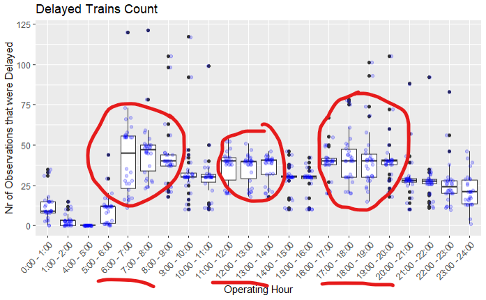

```{r, echo=FALSE , include=FALSE}
## Document related Settings and Libs
library(knitr) 
library(details)    # allows collapsible code blocks
library(gt)         # formats tables nicely

## general language settings
Sys.setenv(LANG = "en")

## Default Settings for R-Chunks
opts_chunk$set(echo = FALSE ,
               include = FALSE,
               comment = NA,
               eval = TRUE,
               message = FALSE,
               warning = FALSE)
```


```{r Import Data and Create Subset for GLM Poisson}

library(dplyr)
library(ggplot2)
library(tidyr)
library(forcats) 
library(lubridate)
library(multcomp)
library(gridExtra)

#### Read in Data ####----------------------------------------------------------
d.poisson<- read.csv("zentrahlbahn_final.csv") %>% 
  dplyr::select(BETRIEBSTAG, LINIEN_TEXT, HALTESTELLEN_NAME, ANKUNFTSZEIT, AN_PROGNOSE,
         ANKUNFTDELAY_sec, ABFAHRTSZEIT, AB_PROGNOSE, ABFAHRTDELAY_sec,FAELLT_AUS_TF,
         Delay_Category, TAGESZEIT, RUSH_HOUR, w_precip_mm_Luzern, w_temp_min_c_Luzern, w_temp_avg_c_Luzern)
```


```{r Add operating hour, include=TRUE}

### First of all we add a categorical variable for every hour per day --> in total 24 categories

d.poisson <-  d.poisson %>% 
  mutate(
    hour = hour(as.POSIXct(ANKUNFTSZEIT, format="%Y-%m-%d %H:%M:%S")), 
    operating_hour = factor(
      paste0(hour, ":00 - ", hour + 1, ":00"),
      levels = paste0(0:23, ":00 - ", 1:24, ":00")
    )
  )
```

```{r Only consider Abfahrtszüge, include=TRUE}

### First of all we add a categorical variable for every hour per day --> in total 24 categories

d.poisson <-  d.poisson %>% 
  filter(!is.na(operating_hour))  # Removes NA observations --> This are the Abfahrtszüge
```
  

```{r Create Subsed for Delayed Train, include=FALSE}

d.poisson.agg.day.oh <- d.poisson %>%
  group_by(operating_hour, BETRIEBSTAG) %>% # Aggregate data by operating hour and delay 
  summarize(
    Count_Delayed = sum(Delay_Category != "On Time"), # Only consider delayed trains
    .groups = "drop"
    ) %>% 
  ungroup()

```
# Poisson Model

## Overview

The goal of this model is to predict the number of delayed trains based on several predictors. The number of delayed trains is aggregated to "operating hour" and "operation day". This means:

 - there are in total 660 observations
 - there are 30 observatios per "operating hour" because the dataset contains the month november, which has 30 days.
 - there are 22 observations per "operating day" because there are in total 23 operating hours , and between 1am and 2am there is no operation


Since the response variable is a count-variable, we expect it to exhibit right skewness and increasing variance as the count increases.

Plotting the data reveals that indeed the count-variable is right-skewed.

```{r Hist Skewed, include=TRUE}
par(mfrow=c(1,2))
hist(d.poisson.agg.day.oh$Count_Delayed, breaks = 20, main= "Original", xlab = "Count 'Delayed Trains '")
hist(log1p(d.poisson.agg.day.oh$Count_Delayed), breaks=20, main = "Log Transformed ", xlab = "Count 'Delayed Trains'")

```

The quartile boxplot does not support the assumption that the variance increases linearly with the mean. This suggests that the count variable may not follow a Poisson distribution. This is an initial indication that the GLM should be fitted with a quasipoisson family to account for overdispersion.

```{r Overdispersion, include=TRUE}
quantile_groups <- cut(d.poisson.agg.day.oh$Count_Delayed, breaks=quantile(d.poisson.agg.day.oh$Count_Delayed), 
                       include.lowest=TRUE, labels=c("Q1", "Q2", "Q3", "Q4"))

boxplot(d.poisson.agg.day.oh$Count_Delayed ~quantile_groups)

```


## Finding reasonable Predictors 

### Operation Category"

Having a predictor operating hour with 24 levels makes the interpretation of the model quite complicated. 
Therefore a first visualization of the data should give an idea if the predictor "operating-hour" can be simplified.


```{r Nr of Delay aggregated per Day and Operating Hour, include=TRUE}
ggplot(d.poisson.agg.day.oh, aes(x =  operating_hour, 
                           y = Count_Delayed)) +
  geom_boxplot() +
   geom_jitter(width = 0.2, height = 0.1, color = "blue", alpha = 0.2)+
  labs(title = "Delayed Trains Count", 
       x = "Operating Hour", 
       y = "Nr of Observations that were Delayed") +
  theme(axis.text.x = element_text(angle = 45, hjust = 1))


```





Indeed there seems to be a pattern in "operation hour". In a first step, the "operation- hour" is simplified by "operation category" with 3 levels:

 - Low Operation : (0:00 until 6:00)
 - Rush Hour : (6:00 until 9:00) and (11:00 until 14:00) and (16:00 until 20:00)
 - Normal Operation : Everything else
 
The boxplot on the left compares the number of delayed trains across operation categories, but this comparison is not meaningful because each category has a different total number of train arrivals. On the right, the delay counts are normalized by the total number of trains in each category. As a result, the differences between the boxplots become less pronounced but more interpretable

```{r Add Operation Category, include=FALSE}

d.poisson <- d.poisson %>%
  mutate(
    ANKUNFTSZEIT = as.POSIXct(ANKUNFTSZEIT, format="%Y-%m-%d %H:%M:%S"),
    operation_category = case_when(
      (hour(ANKUNFTSZEIT) >= 0 & hour(ANKUNFTSZEIT) < 2)|
      (hour(ANKUNFTSZEIT) >= 4 & hour(ANKUNFTSZEIT) < 5) ~ "Low Operation",    # 0am to 6am
      (hour(ANKUNFTSZEIT) >= 6 & hour(ANKUNFTSZEIT) < 9) |  # 6am to 9am
        (hour(ANKUNFTSZEIT) >= 11 & hour(ANKUNFTSZEIT) < 14) | # 11am to 2pm
        (hour(ANKUNFTSZEIT) >= 16 & hour(ANKUNFTSZEIT) < 20) ~ "Rush Hour", # 4pm to 8pm
      TRUE ~ "Normal Operation"   # Everything else
    )
  )

#Create A subset aggregating by operation day and Category
d.poisson.agg.day.oc <- d.poisson %>%
  filter(!is.na(operating_hour)) %>%  # Removes NA observations --> This are the Abfahrtszüge
  group_by(operation_category, BETRIEBSTAG) %>%
  summarize(Count_Delayed = sum(Delay_Category != "On Time"), .groups = "drop") %>% 
  ungroup()

boxplot_bad <- ggplot(d.poisson.agg.day.oc, aes(x = operation_category , 
                           y = Count_Delayed)) +
  geom_boxplot() +
   geom_jitter(width = 0.2, height = 0.01, color = "blue", alpha = 0.2)+
  labs(title = "Delayed Trains Count", 
       x = "Operation Category", 
       y = "Nr of Observations that were Delayed") +
  theme(axis.text.x = element_text(angle = 45, hjust = 1))

```


```{r Normalize for compariosn, include=TRUE}
# Count of observations per operation_category
category_counts <- d.poisson %>%
  filter(operation_category %in% c("Low Operation", "Normal Operation", "Rush Hour")) %>%
  group_by(operation_category) %>%
  summarise(count = n())

category_counts

# Merge the count per operation_category with the dataframe
d.poisson.agg.day.oc <- d.poisson.agg.day.oc %>%
  left_join(category_counts, by = "operation_category") %>%
  mutate(Count_Delayed_Norm = Count_Delayed / count)  # Normalization step

boxplot_good <- ggplot(d.poisson.agg.day.oc, aes(x = operation_category, 
                                 y = Count_Delayed_Norm)) +
  geom_boxplot() +
  geom_jitter(width = 0.2, height = 0.01, color = "blue", alpha = 0.2) +
  labs(title = "Normalized Delayed Trains Count", 
       x = "Operation Category", 
       y = "Normalized Nr of Observations that were Delayed") +
  theme(axis.text.x = element_text(angle = 45, hjust = 1))

grid.arrange(boxplot_bad, boxplot_good, ncol=2)

```


We now perform an ANOVA followed by multiple comparison testing to statistically assess the differences observed in the normalized boxplot.

 - ANOVA confirms that there is a statistically significant difference between at least one of the three operation categories.

 - The multiple comparison test reveals that not all pairwise differences are significant. While 'Low Operation' differs significantly from both 'Normal Operation' and 'Rush Hour', the difference between 'Normal Operation' and 'Rush Hour' is not statistically significant.

This supports our earlier observation from the boxplot and confirms that the predictor is overall significant, though not all categories differ from each other


```{r GLM Poisson: Influence Operation Category, include=TRUE}

d.poisson.agg.day.oc$operation_category <- as.factor(d.poisson.agg.day.oc$operation_category)
anova_model <- aov(Count_Delayed_Norm ~operation_category, data = d.poisson.agg.day.oc)
summary(anova_model)  # Overall ANOVA table

mc <- glht(anova_model, linfct = mcp(operation_category = "Tukey"))
summary(mc)
```
To conclude, the analysis has revealed a valuable predictor that will be utilized in the subsequent modeling phase


### "Event Category"

Creating a level for each Day in November does not make sense. Therefore data are again visualized to see if there are any patterns so that
predictor can be simplified. In the boxplot there are 22 observation per "operation day". One obsevation per operating hour.

The boxplot proposes a separtion into the following 3 Levels:

-  Extreme Days: 22.11 and 23.11
-  Meiringen Reopened : From 25.11 on(see more [here](https://www.zentralbahn.ch/de/kennenlernen/die-zentralbahn/einblicke/wiedereroeffnung-der-strecke-meiringen-interlaken-ost-am-25-november-2024})
-  Normal Operation


```{r Look at Days, include=TRUE}

ggplot(mapping = aes(y = d.poisson.agg.day.oh$Count_Delayed,
x = d.poisson.agg.day.oh$BETRIEBSTAG)) +
  geom_boxplot() + 
  geom_hline(yintercept = 0) + 
  geom_jitter(width = 0.5, height = 0.3, color = "blue", alpha = 0.2)+
  labs(title = "Delayed Trains Count", 
       x = "Operating Hour", 
       y = "Simulated Observations that were Delayed") +
  theme(axis.text.x = element_text(angle = 45, hjust = 1))


```

The boxplot on the left compares the number of delayed trains across event categories, but this comparison is not meaningful because each category has a different total number of train arrivals. On the right, the delay counts are normalized by the total number of trains in each category. As a result, the differences between the boxplots become less pronounced but more interpretable


```{r Add Event Category, include=FALSE}

d.poisson <- d.poisson %>%
  mutate(
    event_category = case_when(
      (BETRIEBSTAG == "2024-11-21") |
      (BETRIEBSTAG == "2024-11-22") ~ "Extreme Days",   
      (as.Date(BETRIEBSTAG) >= "2024-11-25")  ~ "Meiringen Reopened", # 4pm to 8pm
      TRUE ~ "Normal Operation"   # Everything else
    )
  )

#Create A subset aggregating by operation day and day category
d.poisson.agg.day.dc <- d.poisson %>%
  filter(!is.na(operating_hour)) %>%  # Removes NA observations --> This are the Abfahrtszüge
  group_by(event_category,operating_hour) %>%
  summarize(Count_Delayed = sum(Delay_Category != "On Time"), .groups = "drop") %>% 
  ungroup()  # Ungroup after mutation


boxplot_bad <- ggplot(d.poisson.agg.day.dc, aes(x = event_category , 
                           y = Count_Delayed)) +
  geom_boxplot() +
  geom_jitter(width = 0.2, height = 0.01, color = "blue", alpha = 0.2)+
  labs(title = "Delayed Trains Count", 
       x = "Event Category", 
       y = "Normalized Nr of Observations that were Delayed") +
  theme(axis.text.x = element_text(angle = 45, hjust = 1))


```

```{r Normalize for comparison 2, include=TRUE}
# Count of observations per operation_category
category_counts <- d.poisson %>%
  filter(event_category %in% c("Extreme Days", "Meiringen Reopened", "Normal Operation")) %>%
  group_by(event_category) %>%
  summarise(count = n())

category_counts

# Merge the count per operation_category with the dataframe
d.poisson.agg.day.dc <- d.poisson.agg.day.dc %>%
  left_join(category_counts, by = "event_category") %>%
  mutate(Count_Delayed_Norm = Count_Delayed / count)  # Normalization step

boxplot_good <- ggplot(d.poisson.agg.day.dc, aes(x = event_category, 
                                 y = Count_Delayed_Norm)) +
  geom_boxplot() +
  geom_jitter(width = 0.2, height = 0.01, color = "blue", alpha = 0.2) +
  labs(title = "Normalized Delayed Trains Count", 
       x = "Event Category", 
       y = "Normalized Nr of Observations that were Delayed") +
  theme(axis.text.x = element_text(angle = 45, hjust = 1))

  grid.arrange(boxplot_bad, boxplot_good, ncol=2)

```
    


To statistically assess the differences observed in the boxplot, we conduct an ANOVA followed by multiple comparison testing.

 - The ANOVA confirms that there is a statistically significant difference between at least one of the three day categories.

 - The multiple comparison test further reveals that all pairwise differences between the categories are statistically significant.

This indicates that event_category is a strong predictor and will be considered for inclusion in the modeling process.

```{r GLM Poisson: Influence Day Category, include=TRUE}
d.poisson.agg.day.dc$event_category <- as.factor(d.poisson.agg.day.dc$event_category)
anova_model <- aov(Count_Delayed_Norm ~event_category, data = d.poisson.agg.day.dc)
summary(anova_model)  # Overall ANOVA table

mc <- glht(anova_model, linfct = mcp(event_category = "Tukey"))
summary(mc)
```

###  Temperature and Precipitation

Weather data may also influence train delays. In the dataset, daily weather variables such as precipitation and temperature are available for the Lucerne region. However, initial visualizations do not reveal any clear correlation between weather conditions and the number of delayed trains. Despite this, the weather variables are still included in the GLM to assess whether they contribute any predictive value that is not immediately apparent from the visual analysis.

```{r Weather Data, include=TRUE}

d.poisson.agg.day.weather <- d.poisson %>%
  group_by(BETRIEBSTAG) %>% # Aggregate data by operating day
  summarize(
    Count_Delayed = sum(Delay_Category != "On Time"), # Only consider delayed trains
    daily_min_temp = mean(w_temp_min_c_Luzern),
    daily_precipitation = mean(w_precip_mm_Luzern),
    daily_avg_temp = mean(w_temp_avg_c_Luzern),
    .groups = "drop"
    ) %>% 
  ungroup()

plot_min_temp <- ggplot(d.poisson.agg.day.weather, aes(x = daily_min_temp , 
                           y = Count_Delayed)) +
  geom_point() +
  theme(axis.text.x = element_text(angle = 45, hjust = 1))

plot_avg <- ggplot(d.poisson.agg.day.weather, aes(x =  daily_avg_temp, 
                           y = Count_Delayed)) +
  geom_point() +
  theme(axis.text.x = element_text(angle = 45, hjust = 1))


plot_precip <- ggplot(d.poisson.agg.day.weather, aes(x = daily_precipitation , 
                           y = Count_Delayed)) +
  geom_point() +
  theme(axis.text.x = element_text(angle = 45, hjust = 1))

grid.arrange(plot_min_temp, plot_avg, plot_precip, ncol=3)


```

## Building the GLM model

```{r Data for model, include=FALSE}

d.poisson.for.model <- d.poisson %>%
  group_by(operating_hour, BETRIEBSTAG) %>% # Aggregate data by operating hour and delay 
  summarize(
    Count_Delayed = sum(Delay_Category != "On Time"), # Only consider delayed trains
    event_category = first(event_category),
    operation_category = first(operation_category),
    daily_min_temp = first(w_temp_min_c_Luzern),
    daily_precipitation = first(w_precip_mm_Luzern),
    .groups = "drop"
    ) %>% 
  ungroup()

```

To simplify model interpretation, the reference level for both Event Category and Operation Category was set to "Normal operation". This choice facilitates clearer comparisons and makes the interpretation of model coefficients more intuitive.

```{r GLM Poisson: Prepare Data, include=TRUE, echo= TRUE}

# Prepare Reference Level to Normal Operation
d.poisson.for.model$event_category <- as.factor(d.poisson.for.model$event_category) %>% 
  relevel(ref = "Normal Operation")
d.poisson.for.model$operation_category <- as.factor(d.poisson.for.model$operation_category) %>% 
  relevel(ref = "Normal Operation")

```

The initial GLM includes the promising predictors: Operation Category and Event Category. Additionally, it also includes weather-related predictors, which, though not particularly promising, are included to explore their impact. These include Daily Min. Temperature, which is more relevant than the average temperature as extreme temperatures may cause technical defects, and Daily Precipitation.

Looking at the summary, it becomes clear that the weather data do not significantly contribute to the model.

*Note*: The GLM was run with the "quasipoisson" family due to overdispersion. If the model were run with the "poisson" family, the predictor "daily_min_temp" would appear significant, which is clearly incorrect.
 
 
```{r GLM with Weather, echo=TRUE, include= TRUE}
glm <- glm(Count_Delayed ~ operation_category + event_category + daily_min_temp + daily_precipitation,
family = "quasipoisson", data = d.poisson.for.model)

summary(glm)

```
What is evident from the summary is also confirmed by the Drop 1 analysis:

 - Operation Category significantly increases the deviance, indicating its importance as a predictor.

 - The same applies to Event Category, which also contributes meaningfully to the model.

 - In contrast, the weather data does not appear to be useful predictors, as removing them does not substantially affect the deviance.


```{r Drop 1, echo=TRUE, include= TRUE}
drop1(glm, Test = "F")
```
*Therefore for the final model the weather data is dropped!*

```{r Final Model, echo=TRUE, include= TRUE}
glm <- glm(Count_Delayed ~ operation_category + event_category,
family = "quasipoisson", data = d.poisson.for.model)
```

```{r summary and Coef, echo=TRUE, include= TRUE}
glm <- glm(Count_Delayed ~ operation_category + event_category,
family = "quasipoisson", data = d.poisson.for.model)

summary(glm)

exp(coef(glm))

```
The model provides the following interpretations:

 - Intercept: On a normal operation day and during normal operation hours, the average number of delayed observations is 28.

 - Changing the operation to "Low Operation" (while keeping all other factors constant) results in an average of 28 * 0.2 ≈ 6 delayed observations.

 - Changing the operation to "Rush Hour" (while keeping all other factors constant) results in an average of 28 * 1.5 = 42 delayed observations.

 - Changing the event to "Extreme Days" (while keeping all other factors constant) results in an average of 28 * 1.6 = 45 delayed observations.

 - Changing the event to "Meiringen Reopened" (while keeping all other factors constant) results in an average of 28 * 0.45 = 14 delayed observations.


